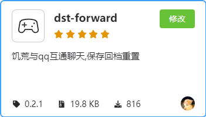

# 原理  

实现qq与饥荒互通需要koishi和饥荒mod以及onebot协议端实现 三端共同的支持  
onebot协议端实现作为qq到koishi的连通手段,  
饥荒mod作为饥荒到koishi的连通手段,  
koishi用来集中消息处理并转发  

# 部署方法

## 1. 单主机部署

此部署方式适用于一台主机同时运行qq机器人和饥荒服务器,相对简单但qq机器人运行可能会占用少许性能,对服务器的稳定性造成影响  
先前往koishi 官网查看教程安装koishi,教程非常详尽.虽然对于从未接触过的新手可能有些许难度,但只要足够细心,遇到问题多搜索,并不算非常难.  
安装完成后在koishi的插件市场中安装koishi插件市场中的onebot适配器插件:  

和dst-forward插件:  

> 请自行了解onebot适配器与协议端实现的连接,由于某种特殊原因这里无法赘述.

现在根据自身情况填写dst-forward的选项:确保你的qq号和群号都填写完成  
在你成功连接上qq并能在qq中调用echo或者help之内的命令(总之你能在qq中访问到koishi机器人)后就可以继续接下来的操作:  
在饥荒联机版创意工坊搜索模组: DST TO QQ  
安装完后创建一个世界(已经存在的世界也行),添加上这个模组,大部分情况下你的qq就已经和饥荒实现互通了.如果没反应,开启模组配置中的日志选项,然后将服务器日志发到我邮箱.
  
## 2. 多主机部署  

此部署方式适用于qq机器人和饥荒服务器分多台主机运行,一台主机专注于饥荒服务器,另一台专注与koishi与qq信息交互,几乎不影响饥荒服务器性能,更流畅游玩,但是要麻烦一点点.

1. koishi端

在你想要部署机器人的服务器上:  
首先开放服务器防火墙的5140TCP端口  
先前往koishi 官网查看教程安装koishi,教程非常详尽.虽然对于从未接触过的新手可能有些许难度,但只要足够细心,遇到问题多搜索,并不算非常难.  
安装完成后在koishi的插件市场中安装koishi插件市场中的onebot适配器插件:

和dst-forward插件:  

请自行了解onebot适配器与协议端实现的连接,由于某种特殊原因这里无法赘述.  
安装完成后先进入server插件的配置选项中将host改为0.0.0.0,然后根据自身情况填写dst-forward插件中的其他必填项,确保你的qq号和群号都填写完成.

2. 饥荒服务器端

在你运行饥荒的服务器上:  
在饥荒联机版创意工坊搜索模组: DST TO QQ  
然后进入你存放mod的文件夹  
一般为  
  
SteamLibrary\steamapps\common\Don’t Starve Together\mods\3325514110\  
  
或  
  
SteamLibrary\steamapps\workshop\content\322330\3325514110  
打开文件夹中的modmain.lua文件,将这里的
`http://127.0.0.1:5140`改为 :`http://你部署机器人的服务器地址`,如 `http://101.132.253.14:5140`  
修改完成后保存退出.  
  
然后创建一个世界(已经存在的世界也行),添加上这个模组,大部分情况下你的qq就已经和饥荒实现互通了.如果没反应,检查你的防火墙是否开放了5140TCP端口,如果无法解决,开启模组配置中的日志选项,然后将服务器日志发到我邮箱.  
教程到此结束,不管有没有问题都欢迎给我发邮件,地址在这里,点进去滑到最下面.
