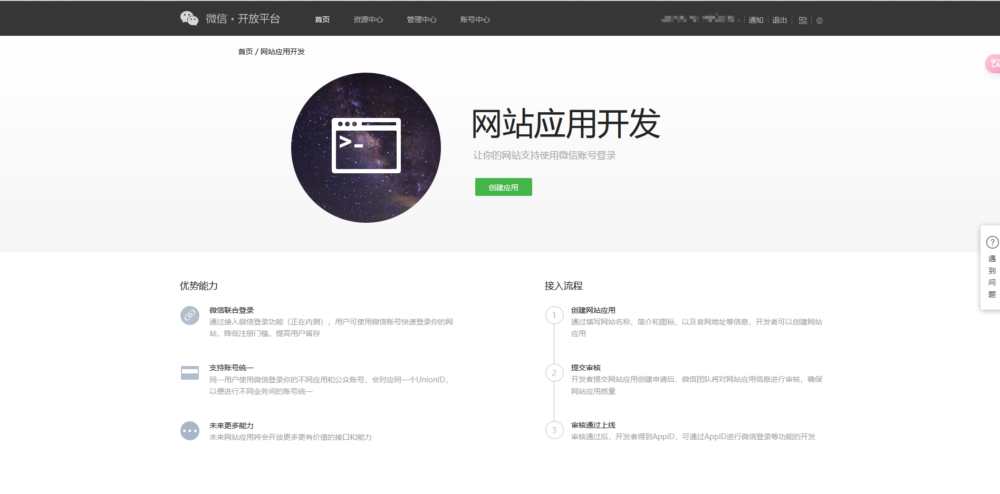
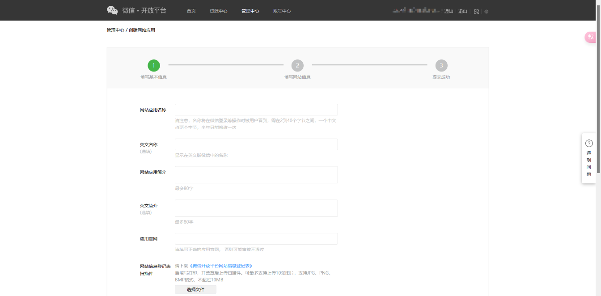

## OAuth2登录介绍

OAuth是一个关于授权（authorization）的开放网络标准，在全世界得到广泛应用，目前的版本是2.0版。
一般OAuth2，能在某个平台通过其他平台或方式登录，比如在自己开发的web应用中，接入QQ，微信，GitHub等第三方登录。OAuth2能让首次使用的用户可以不注册网站账号，使用自己熟悉的平台账号登录，可以简化认证，增强用户体验。

## OAuth2授权原理

借用微信的OAuth2授权登录图


## OAuth2授权流程

这里以微信为例,其他平台的OAuth2认证大体相同

### 第一步：申请开放平台AppID和AppSecret

选择你需要的OAuth授权平台，如微信，就在搜索引擎搜索 “微信开放平台” ，根据其中引导获取AppID和AppSecret。

不少平台的AppID和AppSecret只有企业级应用才能申请。





提交后要等待一段时间审核，审核通过后可以拿到AppID和AppSecret。

### 第二步：请求code

使用我们上一步获取的`AppID`和`AppSecret`，发送get请求到微信的授权url中

示例：`https://open.weixin.qq.com/connect/qrconnect?appid=APPID&redirect_uri=REDIRECT_URI&response_type=code&scope=SCOPE&state=STATE#wechat_redirect`

该页面会有一个登录二维码，如果用户扫码确认这次认证，会返回一个重定向到你申请的应用网址。

示例：`redirect_uri?code=CODE&state=STATE`

### 第三步：通过code获取access_token

使用上一步重定向时接收的`code`以及获取的`AppID`和`AppSecret`，，发送到请求微信token的url中

示例：`https://api.weixin.qq.com/sns/oauth2/access_token?appid=APPID&secret=SECRET&code=CODE&grant_type=authorization_code`

请求成功会返回类似如下的数据：

```JSON
{ 
"access_token":"ACCESS_TOKEN", 
"expires_in":7200, 
"refresh_token":"REFRESH_TOKEN",
"openid":"OPENID", 
"scope":"SCOPE",
"unionid": "o6_bmasdasdsad6_2sgVt7hMZOPfL"
}
```

获取到了`access_token`，就等同于我们已经成功通过了微信的OAuth2登录验证，我们可以使用该`access_token`请求微信提供的api，获取用户信息。

>[网站应用微信登录开发指南 ](https://developers.weixin.qq.com/doc/oplatform/Website_App/WeChat_Login/Wechat_Login.html)  
[理解OAuth2](https://www.ruanyifeng.com/blog/2014/05/oauth_2_0.html)