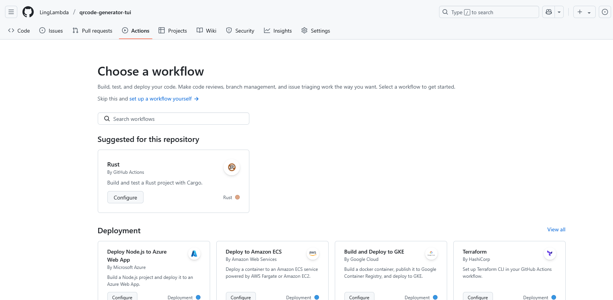
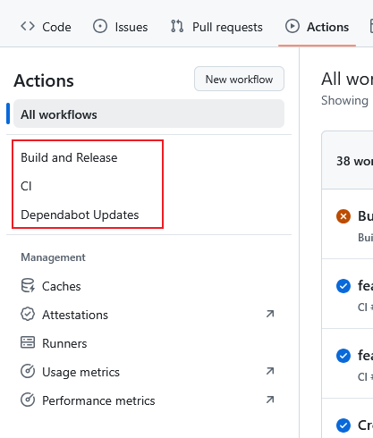

## 什么是 github action

> 摘自<https://github.com/features/actions>: Actions makes it easy to automate all your software workflows, now with world-class CI/CD. Build, test, and deploy your code right from GitHub. Make code reviews, branch management, and issue triaging work the way you want.

译文：GitHub Actions 提供世界一流的 CI/CD，让您轻松自动化所有软件工作流程。直接从 GitHub 构建、测试和部署您的代码。让代码审查、分支管理和问题分类按您期望的方式进行。

GitHub Actions 可以帮助你自动化的进行且不限于以下操作：

代码测试/跨平台构建/打包 docker/issue 管理...... 非常强大！

## 如何使用 github action

想要使用 github action 需要在你的根目录下创建：.github/workflows/\*.yml

更推荐你进入自己的 github 仓库，然后点击在 Pull requests 右边的 Actions，点击左上角的 new workflows ，github 会根据你的项目结构推荐适合你项目的配置文件。



只要配置文件放在 workflows 下且**没有语法错误**，就会自动识别。


## 使用 Github Actions 自动化多平台构建 rust 应用并发布

```yaml
name: Build and Release
permissions:
  contents: write # 设置工作流可写 这个是必须加的，不然发布 release 会报错

on:
  push:
    tags:
      - "v*.*.*" # 使用 $ git push origin <tag> 推送符合 v*.*.* 的 tag 时会触发工作流运行 比如 v0.1.0
  workflow_dispatch: # 使得可以在 github web 界面中手动触发工作流

jobs:
  build: # 这里是第一个任务，用于构建 artifact
    runs-on: ${{ matrix.os }} #使用 matrix 可以让我们方便的跨平台构建程序
    strategy:
      matrix: # 下面的配置会使得本任务使用6个平台同步执行，分别是 ubuntu-latest-x86_64, ubuntu-latest-aarch64, macos-latest-x86_64, macos-latest-aarch64, windows-latest-x86_64, windows-latest-aarch64
        os: [ubuntu-latest, macos-latest, windows-latest]
        arch: [x86_64, aarch64]

    steps:
      - name: Checkout code # 检出代码，是的，只需要两行，程序会自动检出你仓库的代码
        uses: actions/checkout@v4 # 推荐所有 Action 采用最新的版本！查看 Action 最新版本可以在 github 直接搜索对应名称的仓库，如：actions/checkout

      - name: Set up Rust # 配置rust工具链，在配置这个之后我们就可以使用 cargo 命令了
        uses: dtolnay/rust-toolchain@v1
        with:
          toolchain: stable

      - name: Build project # 使用 cargo 编译，这一步在每个平台都是同一条命令，无需额外处理
        run: cargo build --release

      # 在使用 cargo build 后，编译形成的文件会存在执行机的临时目录中，每个 matrix 的目录都是独立的，但他们的名称都叫<project-name>（如果是windows系统则是<project-name>.exe）
      # 正因如此，我们需要区分开不同系统的编译后文件，如下：

      - name: Rename binaries per platform windows
        if: matrix.os == 'windows-latest' # 这里对系统类型进行判断，如果是 windows 系统，文件名末尾要加上 exe ，
        run:
          | # 这里对文件进行重命名 将 <project-name>.exe 变为 <project-name>-<system-name>-<arch-name>.exe
          OUTPUT_NAME="qrcode-generator-tui-${{ matrix.os }}-${{ matrix.arch }}"
          cp target/release/qrcode-generator-tui.exe "target/release/${OUTPUT_NAME}.exe"

      - name: Rename binaries per platform not windows
        if: matrix.os != 'windows-latest'
        run: |
          OUTPUT_NAME="qrcode-generator-tui-${{ matrix.os }}-${{ matrix.arch }}"
          cp target/release/qrcode-generator-tui "target/release/${OUTPUT_NAME}"

      - name: Upload artifact
        uses: actions/upload-artifact@v4 # 重命名后使用这个，可以将本地（执行机）的文件，上传到 github 服务器 作为“构建产物（artifact)，因为每个执行机都会运行，所以会上传六个文件
        with:
          # 动态生成 artifact 名称
          name: ${{ matrix.os }}-${{ matrix.arch }}-qrcode-generator-tui # 这里的 name 是 artifact 的 name ，用来区分 artifact，与真实文件名无关，在后面会用到
          # 设置文件本地的路径
          path: target/release/qrcode-generator-tui-${{ matrix.os }}-${{ matrix.arch }}${{ matrix.os == 'windows-latest' && '.exe' || '' }}

  release: # 从这里开始是第二个任务，因此要重新设置运行环境和拉取代码
    needs: build
    runs-on: ubuntu-latest

    steps:
      - name: Checkout code
        uses: actions/checkout@v4

      - name: Download all artifacts
        uses: actions/download-artifact@v4 # 使用它下载所有的 artifacts 到当前环境，就是我们之前上传的那六个！
        with:
          path: artifacts

      - name: Create GitHub Release and Upload Assets
        uses: softprops/action-gh-release@v2 # 使用它发布我们的文件
        with:
          tag_name: ${{ github.ref_name }} # 当前事件的引用名称，假如我们推送时使用的是 tag 这里就会是 tag 名，如果是 push 则是分支名
          name: Release ${{ github.ref_name }}
          # body: | # 这里写的是你的发布说明，也就是用户在仓库的 release 下看到的！
          #   Changes in this Release
          #   - First Change
          #   - Second Change
          files: | # 使用 glob 一次性匹配所有平台与架构的可执行文件
            artifacts/**
```

以上只是一个简单的例子，Github Actions 的功能非常强大！
