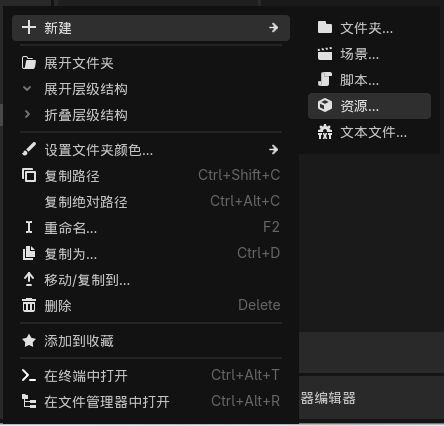
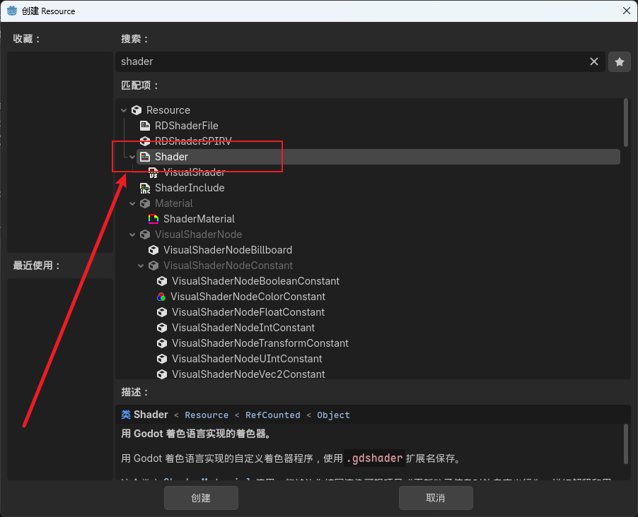
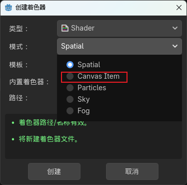
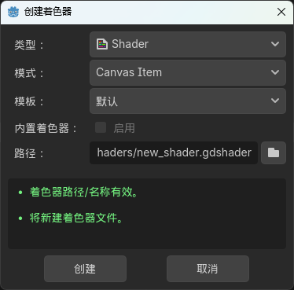
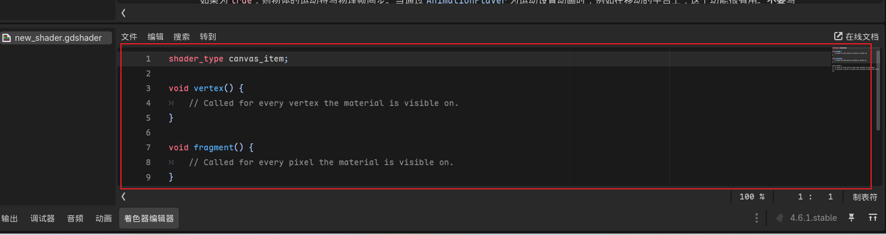
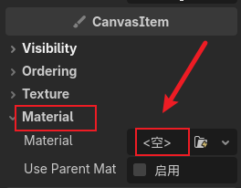
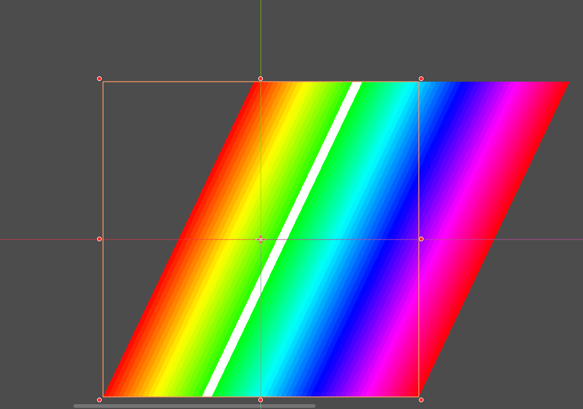

## 创建着色器

文件系统 -> 右键 -> 新建 -> 资源。



搜索 Shader 并选择。


我这里编写的着色器主要用于 2D 精灵，因此我选择 Canvas Item，其他默认，然后点击创建。



## 编写着色器

### 着色器编辑器

双击我们刚才创建的着色器文件，着色器编辑器会打开于 Godot 编辑器下方，Godot 使用类似于 [GLSL ES 3.0](https://zh.wikipedia.org/wiki/GLSL) 的着色语言。


### 编写顶点着色器

顶点着色器用于决定图形的顶点位置，可用于拉伸图形的形状，如创建晃动的草，实现伪3D效果等等。我们在 `vertex()` 函数中添加着色器代码，实现一个使草左右摇晃的动画。

```glsl
void vertex() {
  // 使所有 y 小于 0 的顶点 (精灵图上半部分的顶点) x 轴随时间左右缓慢摇晃
  if (VERTEX.y < 0.0) {
  VERTEX += vec2(sin(TIME * 0.5) * 100.0, 0);
  }
}
```

这段代码的原理在于：随时间拉扯图像上半部分的顶点，使顶点的位置在原始位置x轴坐标 -0.5 和原始位置x轴坐标 +0.5 位置之间摆动，使整体图像拉伸以实现草左右摇晃的效果。

> 注：顶点位置取决于图像的形状，一个 Sprite2D 精灵图未必只有 左上 左下 右上 右下 四个顶点。

### 编写片段着色器

片段着色器用于改变图形的像素颜色，你可以用它改变某片区域的颜色，或者创建特效，改变光照效果等等。在`fragment()`函数中添加着色器代码，我们将使用蒙版技术，实现将特定颜色替换为我们想要的颜色。

```glsl
// 定义变量以方便我们在 Godot 检查器中修改输入颜色
uniform vec3 replacement_color:source_color;

void fragment() {
    // 过滤掉图像中的绿色通道，
    // 这样我们就可以判断哪些区域含有红色和蓝色分量
    vec3 color_without_green = COLOR.rgb * vec3(1, 0, 1);

    // 通过调用 length 函数，
    // 计算当前像素中红色和蓝色的“强度总量”（RGB向量的长度）
    float amount_of_red_and_blue = length(color_without_green);

    // 使用 step 函数创建一个蒙版，标记哪些区域包含红色和蓝色，
    // step 函数可以将 > arg1 的值变为 1，< arg1 的值变为0，
    // 所以这行代码可以将所有存在红色和蓝色通道的区域变为黑色，其他区域变为白色
    float red_and_blue_mask = step(0.1, amount_of_red_and_blue);

    // 创建一个变量，用来保存我们“不想改变”的原始颜色，
    // 此时所有存在红色和蓝色通道的区域变为原始颜色，其他区域变为白色，
    // 因为 1 * x = x, 0 * x = 0
    vec3 retained_color = COLOR.rgb * red_and_blue_mask;

    // 反转 red_and_blue_mask，
    // 并与图像的绿色通道相乘，得到一个用于替换颜色的蒙版混合强度，
    // 乘以绿色的原因在于，根据原始区域的绿色强度，调整替换后的颜色强度
    // 如果原始区域为 0,1,0 （只有绿色通道）则该区域的 green_mask 为 1
    float green_mask = (1.0 - red_and_blue_mask) * COLOR.g;

    // 原始区域绿色越强，替换后的颜色越接近输入颜色
    vec3 masked_replacement_color = replacement_color * green_mask;

    // 最后，将原始颜色与替换颜色进行合成
    COLOR.rgb = retained_color + masked_replacement_color;
}
```

### 应用着色器

选择如 Sprite2D 类的节点，点击检查器中的 Material ，将我们编写的着色器脚本拖动到<空>处。


保存项目，此时你应该能看到着色器的作用了，精灵图根据我们编写的顶点着色器在左右摇晃，且只有绿色通道的区域被替换为了我们设置的颜色。


## 着色器相关网站

你可以在这些网站上参考学习着色器代码。

着色器开源平台 <https://www.shadertoy.com/>

着色器圣经 <https://thebookofshaders.com/>

> 本文参考：<https://www.youtube.com/watch?v=nyFzPaWAzeQ>
