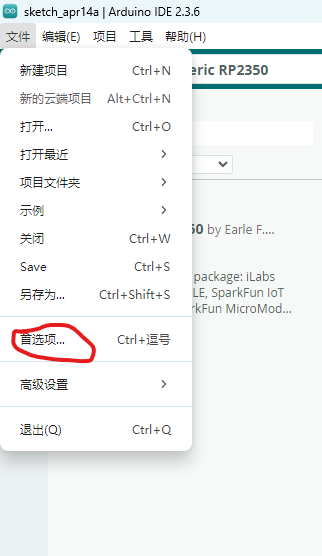
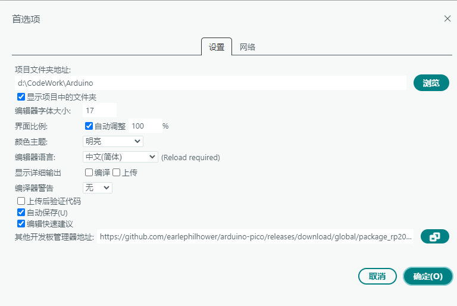
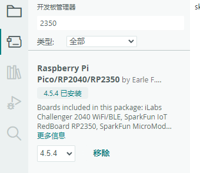
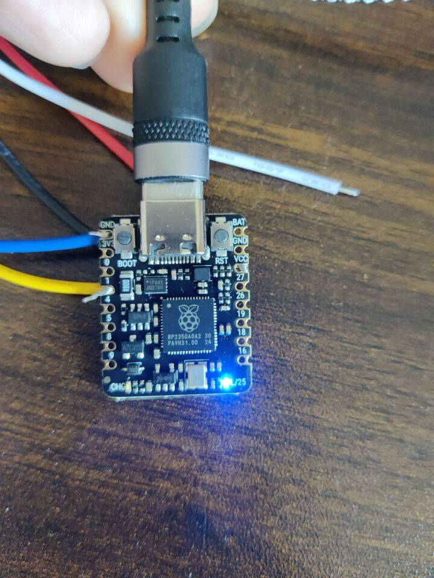
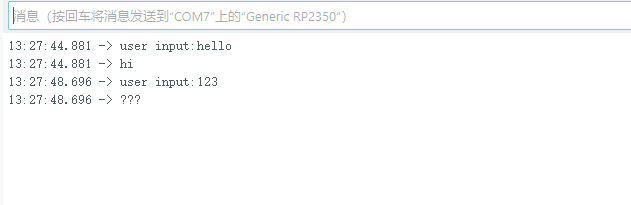
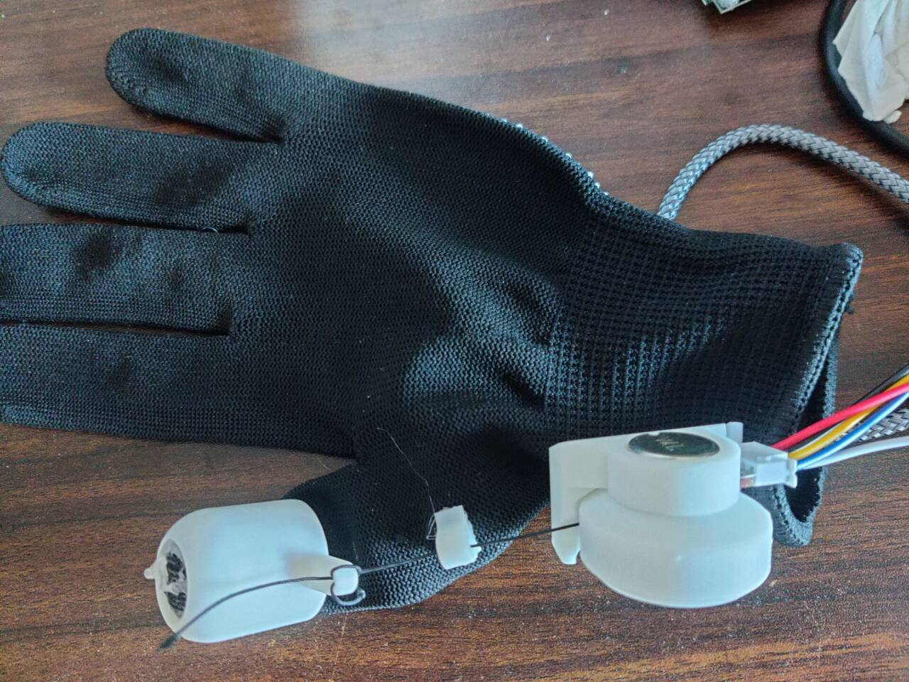
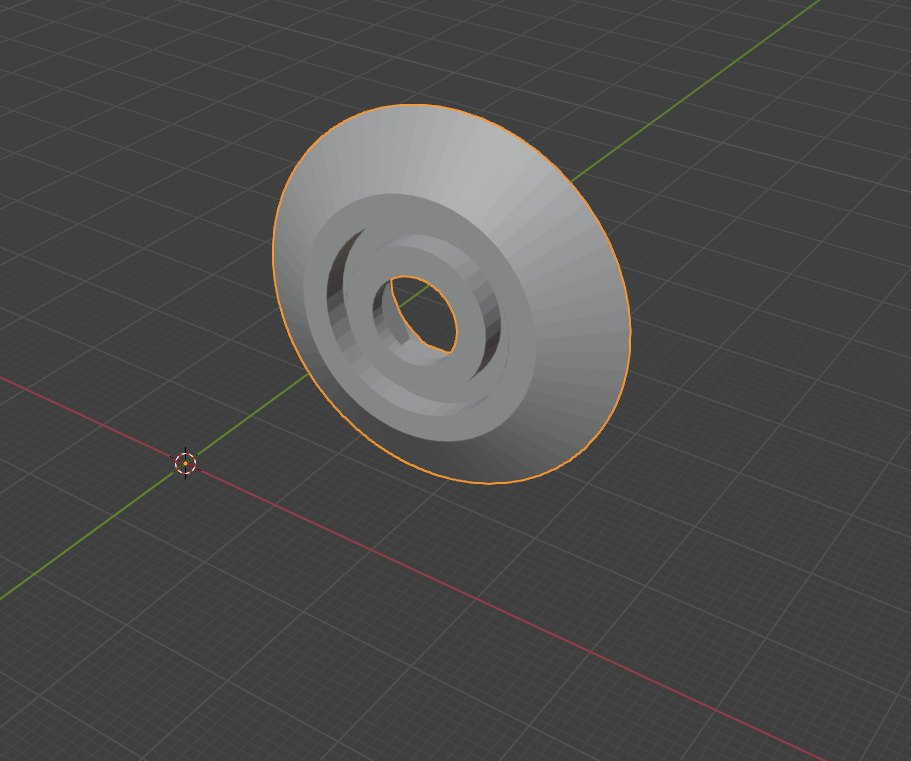

也是非常荣幸能评测 beetle RP2350 啊，板子到手第一感觉就是非常迷你，只有一个硬币大小，很符合其嵌入式穿戴设备的定位。


但是麻雀虽小五脏俱全，RP2350 的功能却是非常强大。如 双 Cortex-M33 核心，运行频率 150MHz，支持浮点运算单元 FPU，增强的安全性和加密功能，集成 RGB LED、2MB Flash、520kB SRAM 和 19 个多功能 GPIO（模拟、数字、I²C、UART、SPI、PWM。还有着相当低的功耗。
RP2350 可以直接在 arduino 中编写上传代码，也可以使用 micropy，我这里就使用 arduino 作为测试了！

RP2350 没有官方的 arduino 库，所以我们需要手动添加社区大佬的库：
点击文件 → 首选项

在其他开发板管理器地址中输入<https://github.com/earlephilhower/arduino-pico/releases/download/global/package_rp2040_index.json>


然后就可以在开发板管理器中搜到 RP2350 了！我们点击安装！


到手第一件事当然是点灯测试：

```ino
int useBin = 25;

void setup() {

  pinMode(useBin, OUTPUT);

}

```

不得不说这块板子不仅迷你，标注也很清晰，一眼就能看到 LED 的引脚编号


然后是串口测试：

```ino
int usePin = A0;

void setup() {

  Serial.begin(9600);

}

void loop() {

  String a = Serial.readString();

  a.trim();

  if(a.equals("")){

    return;

  }

  Serial.println("user input:"+a);

  if (a.startsWith("hello")) {

    Serial.println("hi");

  } else {

    Serial.println("???");

  }

}


```


也是十分顺利了。

最后是重点：VR 手套的实现：
基于大佬的开源项目：<https://github.com/LucidVR/lucidgloves>
原理是通过线缆拉动电位器实现电阻变化，封装为数据包，通过串口与 pc 交互，实现 vr 手套。

项目实现需要自己 3d 打印组件，去 tb 上双手还是比较贵的，要 160 左右，有打印机的朋友推荐自己打，打印件地址位于：<https://pan.baidu.com/s/13fnd0DoCyKVVMZP_ibvFpA?pwd=4h4x>


其实这里应当是每根手指都有一个的，有个滑轮顶盖商家看错了打少了，只打了一个，就是下面这个：这两天还在加紧补发呢，等到了之后会及时更新的！暂时就只能先演示一根手指的了

其他打印件：

项目原本是基于 arduino nano 的，所以要在咱们的 2350 上运行需要做一点小小的修改（主要是引脚）。项目有一定复杂度（不算很复杂）这里就只贴部分需要修改的代码了：
在 lucidgloves-firmware.ino 中：
将下方的引脚定义添加一个 elif 修改为你需要的引脚，我这里只设置了拇指为 26。其他的力反馈，摇杆，可以根据自身情况修改

```ino
#elif defined(ARDUINO_GENERIC_RP2350)

  #define PIN_PINKY     1

  #define PIN_RING      1

  #define PIN_MIDDLE    1

  #define PIN_INDEX     1

  #define PIN_THUMB     26

  #define PIN_JOY_X     16

  #define PIN_JOY_Y     18

  #define PIN_JOY_BTN   19

  #define PIN_A_BTN     19

  #define PIN_B_BTN     19

  #define PIN_TRIG_BTN  19 //unused if gesture set

  #define PIN_GRAB_BTN  19 //unused if gesture set

  #define PIN_PNCH_BTN  19 //unused if gesture set

  #define PIN_CALIB     19 //button for recalibration

  #define DEBUG_LED     LED_BUILTIN

  #define PIN_PINKY_MOTOR     19 //used for force feedback

  #define PIN_RING_MOTOR      19 //^

  #define PIN_MIDDLE_MOTOR    19 //^

  #define PIN_INDEX_MOTOR     19 //^

  #define PIN_THUMB_MOTOR     19 //^

  #define PIN_MENU_BTN        19

#endif
```

然后是 AdvancedConfig.h 中，需要手动设置最大模拟值，取消这行注释并自己设置一个值。

```ino
#define ANALOG_MAX 1023
```

遗憾的是，2350 只支持 4 个模拟引脚。但它真的非常迷你，很喜欢的一款开发板！
<video id="video" >
<source id="mp4" src="https://o.llma.top/videosKgkoAz-gloves.mp4" type="video/mp4">
</videos>
