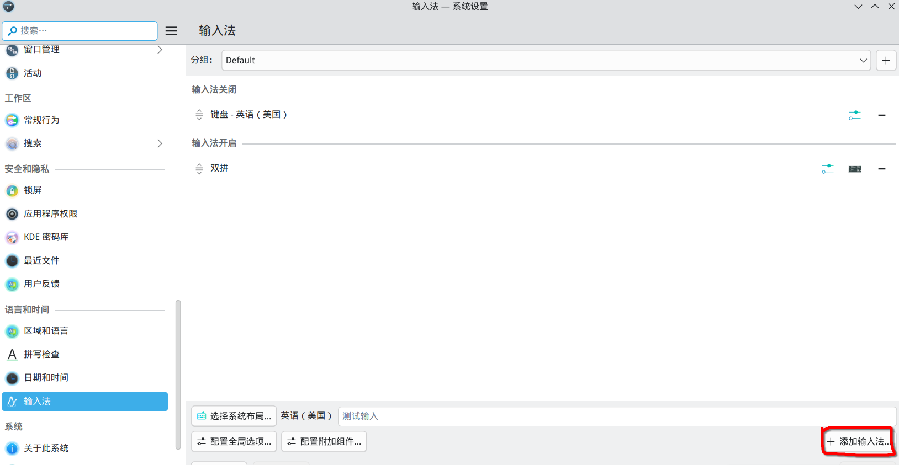
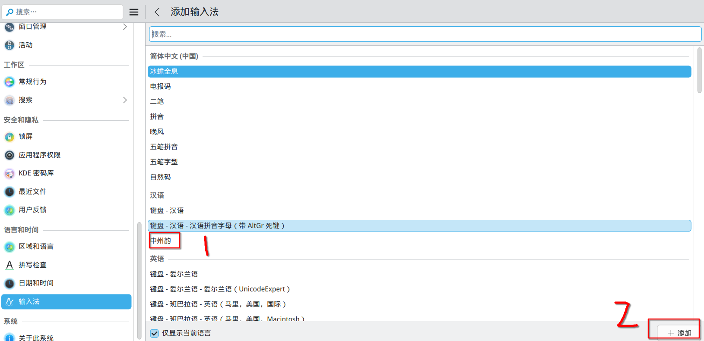

## 1. 安装中州韵输入法前端

`yay -S fcitx5-rime`

## 2. 安装雾凇拼音(小鹤双拼方案)

如使用其他方案安装对应的软件包即可  
[所有方案](https://aur.archlinux.org/packages/rime-ice-git)  
`yay -S rime-ice-double-pinyin-flypy-git`

## 3. 启用中州韵输入法

  


## 4. 创建中州韵配置

`mkdir ~/.local/share/fcitx5/rime/`  
`cd ~/.local/share/fcitx5/rime/`  
`touch default.custom.yaml`  
编辑default.custom.yaml为如下内容

```yaml
patch:
# 仅使用「雾凇拼音」的默认配置，配置此行即可
__include: rime_ice_suggestion:/
# 以下根据自己所需自行定义，仅做参考。
# 针对对应处方的定制条目，请使用 <recipe>.custom.yaml 中配置，例如 rime_ice.custom.yaml
```

## 5. 重载配置

`rm ~/.local/share/fcitx5/rime/default.yaml && fcitx5-remote -r`


## 6. 完成


> 参考： [archlinux wiki上的rime页面](https://wiki.archlinuxcn.org/wiki/Rime)
