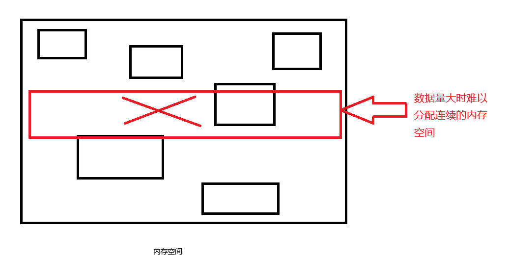

## 1.NoSql 简介

NoSql: Not Only Sql; 不仅仅是 sql，一般泛指非关系型数据库，如 redis。

### 特点:

1. NoSql 数据库的存储不依赖业务逻辑，使用 key-value 的结构进行存储。这样的存储方式最大的优势就是具备很大拓展性

2. 不支持 ACID

3. 不支持 SQL 标准

4. 相比较与关系型数据库具备高性能

### 应用场景：

1. 高并发的数据读写

2. 海量数据的读写

3. 具备时效性的数据存储

### 不支持的应用场景：

1. 结构化数据的查询

2. 牵扯到业务的事务操作

### Redis 简介：

Redis 是开源的 KV 存储系统，支持多种数据类型的存储（针对 value 来说）。数据的存储是基于内存的，虽然数据存储在内存中，但是提供了持久化的方案（定期将数据写入磁盘）

## 2. redis 编译安装

> 更推荐使用包管理器安装，此处只做示范

### 1. 准备 c 语言编译环境

#### 1.1 检查当前系统是否具备 gcc

`gcc -version`

#### 1.2 安装 gcc（已存在则跳过此步骤）

```shell
yum -y install gcc
pacman -S gcc
apt install gcc
```

#### 1.3 再次检测

`gcc --version`

#### 1.4 安装 redis 需要的开发包（centos）

```shell
yum -y install devtoolset-9-gcc devtoolset-9-gcc-c++ devtoolset-9-binutils
scl enable devtoolset-9 bash
echo "source /opt/rh/devtoolset-9/enable" >>/etc/profile
source /etc/profile
```

### 2. 安装 redis

#### 2.1 使用 XFTP 把安装包拉取到对应位置（`/opt/software`）

#### 2.2 解压安装包

`tar -zxvf redis...tar.gz`

#### 2.3 进入解压后文件夹

`cd redis`

#### 2.4 执行编译

`make MALLOC=libc`

#### 2.5 执行安装

`make install`

#### 2.6 安装后服务安装在`user/local/bin`中

### 3. redis 安装目录解读

`redis-cli`：客户端

`redis-server`：redis 的服务脚本

`redis-check-aof`：持久化使用

`redis-check-rdb`：持久化使用

`redis-sentinel`：redis 集群使用

### 4. 启动 redis 服务

> 包管理器安装建议直接`systemctl enable redis`

#### 4.1 默认启动

`redis-server`：以默认的配置方式启动（不推荐）
以下是你提供的内容的格式化版本：

### 4.2 自定义配置文件启动

#### 1. 复制配置文件

默认配置文件的位置在 `/opt/software/redis/redis.conf`，使用以下命令复制配置文件：

```shell
cp redis.conf /usr/local/bin
```

#### 2. **修改配置文件**

打开 `redis.conf` 文件，找到并修改以下配置项以启用后台启动：

```shell
daemonize no  # 将 no 修改为 yes，即可启用后台启动
```

#### 3. **根据配置启动 Redis**

使用修改后的配置文件启动 Redis：

```shell
1) redis-cli shutdown
2) redis-cli -p 6379 shutdown 关闭指定端口号的redis服务  redis-server /usr/local/bin/redis.conf
```

### 5. 关闭服务

```shell
1) redis-cli shutdown
2) redis-cli -p 6379 shutdown 关闭指定端口号的redis服务
```

## 3. Redis 基础知识

- redis 是单线程的（但是 redis 是单线程的多路 IO 复用）

- redis 一共有 16 个库，0-15

- 默认情况使用第一个库（0）

- redis 的账户和密码可以管理所有的库

## 4. Redis 数据类型

### 1. Key

常用指令：

```shell
keys * ：查看当前库所有的key
type key ：查看具体的key对应的value类型
del key... ：删除指定的key
exists key ：判断key是否存在；0：不存在 1.存在
ttl key ：查看key的剩余有效时间；-1：永不过期 -2：已经过期或不存在 n：剩余有效时间
expire key seconds ：给指定的key设置有效时间（单位为秒）
dbsize ：获取当前库所有的key的数量
select n ：切换库（0-15）
flushdb ：清空当前库
flushall ：清空所有库
clear ：清屏
```

### 2. 字符串（String）

String 是 redis 中最基本也是应用最多的数据类型。此 String 类型其实就是一个二进制并且数据安全的数据类型，也就说明了 Redis 中的 String 可以转储任何文件和数据。但是 Redis 中的 String 类型有最大存储限制。最大的单元室为 512MB。

常用指令：

```shell
set <key> <value>：添加一组kv数据。（如果key已经存在则是覆盖）
get <key> ：获取指定的key对应的value
append <key> <value> ：在value原有的基础上进行追加操作
setnx <key> <value> ：如果key不存在则是添加，存在则操作失败，不会进行覆盖行为。
strlen <key> ：获取key对应的value长度
incr <key> ：把当前key对应的value数值+1
decr <key> ：把当前key对应的value数值-1
PS：以上两个操作只对数字有效，如果是非数组则执行运行出错
incrby/decrby <key> <step>：同样是自增自减，但可以设置步长

mset <key> <value> [<key> <value>...]：批量添加
mget <key> [<key>...]：批量获取
msetnx <key> <value> [<key> <value>...]：批量的mset操作

setex <key> <seconds> <value>：添加kv数据的同时并设置有效时间（单位秒）
```

### 3. 列表（List）

就是一个 key 对应一组内存空间。站在使用的角度来说就是一个 key 对应一个 value（数组/双向链表），不过这个 value 中包含了多个字符串（element）
底层使用的是数组/双向链表

常用指令：

```shell
lpush/rpush <key> <element...>：从左边/右表插入一条或者多条数据。（如果key已存在则追加）
lrange <key> <start> <stop>：从坐标开始获取（0表示第一个坐标 -1表示最后一个坐标）
lpop/rpop <key>：从左边/右边弹出一条数据（既是获取也是删除）。所有的element都弹出后key消失
lindex <key> <index>：获取key对应的列表指定索引位置的数据
lrem <key> <count> <element>：从坐标删除指定数量的element（如 lrem list 1 laowang）
lset <key> <index> <element>：替换指定索引位置的值
lisert <key> [before|after] <element> <newelement>：在指定的key对应的value的element前（before）/后（after）添加新数据
```

### 4. 集合（Set）

set 提供的功能和 List 类似。区别就是 Set 具备了自动去重的功能。Set 本质上就是一个 String 类型的无序集合（对于插入顺序来说）。底层使用 hash 表。

常用指令：

```shell
sadd <key> <member>... ：将一个或多个member元素放到集合中，已经存在的数据会被忽略
smembers <key> ：获取指定key对应集合中所有的元素
sismember <key> <member> ：判断集合中是否存在某个值 返回：1.存在  0.不存在
scard <key>：返回集合中元素的个数
srem <key> <member>... ：删除集合中一个或者多个元素
spop <key> [count] ：随机从集合中弹出一个或者多个元素。（即使获取也是删除，集合中所有的元素都弹出后集合本身也会删除）
srandmember <key> [count] ：随机从集合中获取一个或多个元素（不会删除元素）
smove <source> <destination> <member> ：从指定集合中将元素移动到目标集合中
sdiff <key> <key> ：计算两个集合的差集元素
sunion <key> <key> ：计算两个集合的并集元素
sinter <key> <key> ：计算两个集合的交集元素
```

### 5. 有序集合（Zset）

Zset 和 Set 基本一样，都是一个不可重复的字符串的集合。区别就是 set 是无序的，而 Zset 每个元素都关联着一个评分的值，这个评分值会被元素进行排序。元素不能重复但评分可以重复。

常用指令：

```shell
zadd key <score member> [score member ...] ：将一个或者多个member+score添加到有序集合中。如果member已存在则更改member对应的score
zrange <key> <start> <end> [withscores] ：获取坐标start到坐标end的所有member，携带withscores则把对应的评分一并展示。
zrangebyscore <key> <minscore> <maxscore> [withscores] [limit offset size] ：获取指定评分范围内的数据。可以进行分页展示
zcount <key> <minscore> <maxscore> ：获取指定区间内的元素的个数
zrem <key> <member> ：删除指定的元素
zrank <key> <member> ：获取指定元素在集合中的排名（从0开始计算）
```

### 6. 哈希（Hash）

hash 也是一组 kv 结构，hash 是一个 string 类型的 filed 和 value 的映射表。比较适合存储对象。类似于 Java 中的`Map<String,Object<String,String>>`。

常用指令：

```shell
hset <key> <filed> <value> [<filed> <value>...]：来添加数据
hkeys <key> ：获取key对应hash中所有的filed
hvals <key> ：获取key对应hash中的所有value
hget <key> <filed> ：获取key对应的hash中filed对应的value
hexists <key> <filed> ：判断key对应的hash中是否存在指定的filed
```

## 5. 数据类型底层结构

### 1. String 底层结构

redis 中的 String 有三种编码类型。int，embstr，raw 三种。在不同情况下会自动切换

String 的底层结构是一个动态字符串（SDS），在数据编码为 embstr，raw 的时候底层使用的就是 SDS

```c
SDS结构 {
  int len;
  int free;
  char buf[];
};
```

len：记录 buf 数组中已经使用的字节的数量。也就是 SDS 结构体存储的字符串长度。

free：记录 buf 数组中未使用的字节长度。

buf[]：字节数组，用来保存实际的字符串。

> 当存储字符串的字节长度小于等于 48 时使用 embstr，大于 48 则使用 raw。

**问题：为什么不使用 C 语言本身的字符串类型进行存储而选择构建一个动态字符串（SDS）？**

- 防止缓存区溢出

  字符串使用时存在扩容问题。而 C 语言在扩容字符串的时候需要考虑缓冲区是否足够。但是 C 语言关于内存没有自动回收机制，所以在扩容时可能出现一处错误。SDS 结构体提供了 API 来帮助判断并完成扩容。

- 获取字符串长度方便

  C 语言中无法直接获取字符串的长度，需要对字符串整体进行遍历。所以获取 C 语言的字符串长度的时间复杂度为 O(n)，而 SDS 结构可以使用 len 属性获取字符串长度，时间复杂度为 O(1)。

- 减少内存分配的次数

  所谓的扩容就是申请更大的内存空间，然后把旧数据拷贝到新的内存空间中，并释放旧的内存空间，反之缩小也是一样的。而 SDS 结构就可以大量的减少内存分配和释放，提高效率。

- 二进制安全问题

  C 语言中可以使用空字符作为字符串结尾的标识。而一些二进制文件的内容（图片，视频，音频）大概率会出现空字符，这样的特性就导致 C 语言本身的字符串无法存储二进制文件数据。而 SDS 是以二进制的方式进行存储数据。字符串的结束时以 len 的属性值作为标识。

### 2. List 底层结构

底层数组结构：

3.2 之前使用 ziplist,而后续版本使用的都是 quickList

- 压缩列表（zipList)  
  此数据类型的结构类似于数组，和数组的区别在与在表头添加了三个字段 zlbytes，zltail，zllen 以及在尾部添加了一个 zlend 表示列表数据。

zlbytes：内存的字节数
zltail-offser：列表尾的偏移量（用于定位 value 的结束）
zllen：列表元素的个数
zlend：列表结束的标识

因为是一组连续的内存空间，除了上述四个组成部分外其他都是 Node 节点。

```c
Node结构{
  previous_entry_length:
  encoding:当前节点的数据类型和长度
  content：当前节点的值
}
```

- 快速列表（QuickList）
  快速列表就是 ZipList+双向链表。在宏观的角度上来说就是每个双向链表的节点都挂载了一个 ZipList

为什么使用 QuickList？
ZipList 在数据量较大的时候性能会急剧下降，且数据量较大时很难分配连续的内存空间。



解决方案：

使用双向链表可以占用大量的碎片化内存空间，每一个碎片化的内存空间再组成一个 ZipList。这样的设计既解决了连续内存空间的问题也解决了数据量大的时候 ZipList 性能低下的问题。


### 3. Set 底层结构

Set 底层使用 IntSet 或者 HashTable 进行存储

Set 集合满足以下两个条件的时候才会使用 IntSet

1. 所有的元素都是整数数值

2. 元素的个数不超过 512 个

```c
inset(整型数组){
  uint32_t encoding;
  uint32_t length;
  int8_t contents[];
}
```

encoding：决定了 contents 数组存储的整数的数据类型，可选值为`NTSET_ENC_INT16`,`NTSET_ENC_INT32`,`NTSET_ENC_INT64`

length ：数组的长度

contents ：用于存储数据的数组，并且从小到大排序

当存储的数据不满足上述两个条件的时候则使用 HashTable 进行存储

### 4. Zset 底层结构

数据结构

ZipList 或者 SkipList

当满足以下条件的时候使用 ZipList

- 元素的数量小于 128

- 元素的长度小于 64

其他情况都使用 SkipList

```c
SkipList{
  ZipList;
  HashTable;
}
```

ZipList：用于快速地方位查找

HashTable：在查找的时候定位到具体的 ZipList，快速定位到单个元素

底层真正的实现是跳表（SkipList）

### 5. Hash 底层结构

数据结构

ipList 或者 HashTable

当同时满足以下条件的时候使用 ZipList

- hash 对象中所有键值对（filed 和 value）值的长度都小于 64 字节

- hash 对象的键值对数量小于 512 个

其他情况都使用 HashTable 储存

## 6. Redis 配置文件

### 1. 度量单位

在配置文件开头到 INCLUDES 之间的配置。定义了 redis 中支持的最基本的度量单位 bytes。并且列举了各个单位之间的转换。同事记得 redis 的度量单位是不区分大小写的。

### 2. INCLUDES

类似于 JSP 中的 include，在同一台机器上可以配置多个 redis 示例，此时可以把多个 redis 实例的公共配置提取出来，然后在各个实例配置使用 INCLUDES 导入公共配置部分。

范例：
`include /path/to/other.conf`

### 3. NETWORK

1. bind

默认的配置是`bind 127.0.0.1`，此配置表示只能接受本地的访问请求

如果注释掉就表示无限制接收任何 IP 地址的访问。

生产环境下必须写成应用服务器所在的 IP 地址

2. protected-mode

默认配置是`protected-mode yes`，表示 redis 只会响应本机的访问请求，因为此种特性此配置也称之为本地访问保护模式，一般设为 no

3. port

端口号，默认为 6379

4. tcp-backlog

在高并发的情况下可以提高此配置的值来解决慢客户端连接问题

5. timeout

一个空闲的客户端维持多久会关闭。0 表示永不关闭，在生产环境下一般会修改

6. tcp-keepalive

对访问客户端的一种心跳机制。每多少秒检测一次，设置为 0 表示不进行心跳检测。一般设为 60。

### 4. GENERAL

1. daemonize

是否设置为后台启动。一般为 yes

2. pidfile

运行 pid 信息存放的位置

3. loglevel

设置 redis 的运行的日志级别。支持四种日志的级别配置（debug，verbose，notice，warning）

生产环境一般配置为 warning

4. databases

设置 redis 中库的数量，默认为 16

### 5. SECURITY

requirepass foobared

设置 redis 的密码

### 6. 客户端

maxclients 10000

设置客户端的最大连接数，默认为 10000，超过连接部分会拒绝连接并返回“超过最大连接数量”的提示信息

### 7. MEMORY MANAGEMENT（内存管理）

1. maxmemory <bytes> （最大内存）

生产环境下必须配置，否则会造成内存打满导致服务器宕机

配置是配置 redis 能占用的最大内存

设置了此配置后，一旦内存的使用达到阈值则会进行移除数据的行为。具体移除数据的策略是由 maxmemory-policy 的配置决定的。如果占用内存达到阈值后进行移除数据的时候无法通过 maxmemory-policy 配置进行数据移出，那么 redis 会对 set，sadd，lpush 等等需要添加数据的指令进行报错并且返回错误信息。但是不影响其他指令的运行。

2. maxmemory-policy(数据移除策略)

可选配置：

`volatile-lru` 使用 LRU 算法移除 key。但是只对设置了有效时间的 key 生效。（最近最少使用）

`allkeys-lur` 使用 LRU 算法移除 key。对所有的 key 生效。(最近最少使用）

`volatile-lfu` 使用 LFU 算法移除 key。但是只对设置了有效时间的 key 生效。（最近最少使用）

`allkeys-lfu` 使用 LFU 算法移除 key。对所有的 key 生效。(最近最少使用)

`volatile-ttl` 根据 TTL 的值进行移除。

`noeviction` 默认配置。不进行移除。针对于写操作返回错误信息。

LRU：基于访问时间顺序

LFU：基于访问频率

3. maxmemory-samples

设置 LRU 算法，LFU 算法和 TTL 算法需要的样本数据。一般推荐设置为 3-7 之间，默认为 5，5 基本就是最佳配置。样本数量越大算法结果越精准但是效率越低。样本越小越不精准效率越高。

## 7. 发布和订阅

redis 的发布订阅是一种简单的消息通信模式。发送者（pub）负责发送消息，订阅者（sub）负责接受发送者的消息。订阅者可以订阅任意数量的频道。

测试案例：

1. 订阅者订阅频道

`SUBSCRIBE <pub>...`

2. 发送者把消息推送到频道中

`PUBLISH <pub> <message>`

## 8. Redis 事务

Redis 事务是一种单独的隔离操作。事务中所有的指令都会排序，按照排序有序执行。事务在执行过程中不会被其他客户端的发送指令请求打断

总结来说 redis 的事务的作用就是串联多个指令，防止其他指令插队。

回滚机制：

1. 在指令组队阶段，如果某条指令出现了语法错误那么整个队列在 exec 阶段都会执行失败。（语法错误会导致事务整体回滚）

2.在指令组队阶段没有语法错误但是出现了执行错误。那么只会造成错误语句无法执行但是不影响其他指令的执行（执行错误只影响本身，不会造成事务整体回滚）

## 9. 持久化

持久化：随着计算机开关机数据不会丢失

磁盘（ROM）：具备持久化的能力

内存（RAM）：不具备持久化的能力（电脑重启或关机，内存中的数据会全部清空）

Redis 中提供了两种持久化方案：AOF 和 RDB

RDB：Redis DataBase：存储真实的数据

AOF：Append Of File：存储操作的指令

通过测试得知 Redis 默认是开启持久化的

### 1. RDB

#### 1. 简介

RDB 就是在指定的时间间隔内将内存中数据快照写到磁盘中，也就是 snapshot 数据快照。关机或者重启电脑后重新启动 redis 服务 RDB 就会恢复数据，此种持久化恢复时间速度快。

#### 2. 持久化流程

在满足 RDB 的持久化策略的时候，Redis 会创建一个子进程进行持久化工作，子进程会将数据写到一个临时文件中，当所有的数据都写入完成后，再使用这个临时文件去替换上一次已经持久化完成的文件。在整个持久化的过程中主线程（Redis）不会进行任何 IO 操作，这样就能保证主进程的性能。

如果需要进行大规模数据恢复业务并且对数据完成性要求不高的情况下那么 RDB 比 AOF 更高效。但是 RDB 的缺点就是最后一次持久化的数据可能会丢失。（如在持久化时断电）

RDB 在 Redis 中是默认开启的。（且无法关闭，后面会叙述原因）

#### 3. 使用 RDB

1. 解读配置文件中关于 EDB 的部分

`dbfilename dump.rdb` RDB 持久化文件的名字

`dir ./` 设置持久化文件所在的目录

2. 持久化生效的方式

- 满足持久化的策略配置

`save 900 1` 15 分钟至少一个 key 发生改变

`save 300 10` 5 分钟至少 10 个 key 发生改变

`save 60 10000` 一分钟至少 10000 个 key 发生改变

- 手动进行持久化

`save` 使用 save 指令进行持久化时会阻塞主线程的行为，在 save 进行客户端无法连接 redis 主线程，等 save 操作完成后，redis 主线程才开始投入工作吗，此时客户端才可以连接。

`bgsave` 复制了一个 save 子进程，此时再执行 save 指令不会影响到主进程。客户端也可以正常连接和操作 redis。当子进程执行完毕后会通知主线程，子进程自动关闭。所以一般推荐使用此指令。

- 指令顺带持久化

`shutdown` 关闭 redis 服务，在关闭服务前先进行持久化

`flushall` 也会进行持久化，会产生一个空的持久化文件(dump.db)

#### 4. 其他配置项

`stop-writes-on-bgsave-error yes` 当 Redis 无法持久化的时候直接关闭 Redis 的写操作。推荐 yes。

`rdbcompression yes` redis 的数据进行持久化的时候是否需要压缩。压缩使用 LZF 算法。会消耗一定的 CPU。

`rdbchecksum yes` redis 的数据进行持久化耳朵时候是否进行数据校验。校验使用 CRC64 算法。开启会丢失 Redis10%左右的性能

### 2. AOF

#### 简介

AOF 是以日志的方式记录每一个写的操作。当满足 AOF 持久化策略的时候会将记录的指令全部追加到文件中。操作不会记录数据，使用 AOF 恢复数据时，Redis 会读取 AOF 文件，然后将其中的指令全部执行一遍。

#### 持久化流程

1. 客户端所有的写操作都会追加到 AOF 缓存区中

2. AOF 缓存区根据 AOF 的持久化策略将缓存区中保存的写操作指令通过一个同步函数写入到磁盘中的 AOF 文件

3. AOF 文件本身具备重写策略，所谓的重写策略就是对 AOF 文件的压缩

4. Redis 重启后会加载 AOF 文件并进行数据恢复（执行 AOF 文件中的指令）

#### 使用 AOF

默认情况下 AOF 是不开启的，如果开启了 AOF 的话那么 redis 默认的持久化采用 AOF。

1. 开启 AOF

`appendonly yes` 表示开启 AOF

`appendfilename "appendonly.aof"` AOF 文件的名字

2. AOF 的持久化策略

`appendfsync always` 客户端每次写操作都会调用一次同步函数，将缓存区的指令写入到 AOF 文件中。这种持久化策略可以保证数据一定不丢失。但是速度慢。

`appendfsync everysec` 默认选项。每秒调用一次同步函数。将缓存区内的指令写入到 AOF 文件中。这种持久化策略可能会丢失最近一秒的数据。但是效率比 always 更快。

`appendfsync no` Redis 服务不会在主动调用同步函数。而是由系统决定什么时候调用。这种持久化策略是不可控的。所以也不能保证丢失数据的数量。

### 3. 总结

RDB 的优缺点

优点：RDB 文件存储的是数据。当出现大规模数据恢复的时候效率比较快。

缺点：

1. 可能造成大量数据丢失

2. 子进程在持久化的时候会读取内存中的数据，为了不影响主进程的运行会对内存中的数据进行 copy，此时计算机就要应对内存数据的两倍膨胀。

AOF 的优缺点：

优点：

1. 持久化策略比较完善，丢失数据的概率小。

2. AOF 文件具备可读性，可以通过 AOF 文件回溯误操作。

缺点：

1. 相比较于 RDB 来说需要更多的磁盘空间。

2. 恢复速度慢。

3. 常用的持久化策略需要经常进行同步操作，有性能压力。

4. 无法单独使用 AOF，假如本身出现 bug，会导致数据无法恢复。

官方建议两者都开启混合使用。

## 10. 主从复制

### 1. 简介

简介：将一台 redis 服务器上的数据复制到其他服务器，数据来源的节点称之为主节点（master），数据的接受节点称之为从节点（slave）。是一种 Redis 的集群模式，也是读写分离的体现。

特点：

1. 数据复制是单向的，只能从主到从。

2. master 以写为主，slave 只负责读。

3. redis 服务器启动的时候， 如果不进行任何设置，每台 redis 服务重启都是一个 master，需要通过设置修改此身份为 slave。并且任何一个 master 都可以设置多个 slave，但是 slave 只能有一个 master。

总结来说，使用多态 redis 服务器同时工作，降低每台服务器的工作压力，从而提升整个集群的效率，同时具备了读写分离的能力。

### 2. 为什么要使用主从复制

1. 单机 redis 的缺点

1) 服务器宕机（损坏造成的宕机）直接导致数据全部丢失

2) 内存峰值问题，任何一台机器内存都会达到极限，无法无限升级。

2. 主从复制的有点

1) 数据冗余：实现了数据的热备份，在极端情况下，部分服务器损坏依然可以恢复数据，是持久化以外的另一种数据冗余方式

2) 故障恢复：当主节点（master）出现问题的时候，可以由从节点提供服务。实现了故障的快速恢复。这就是一种服务冗余。

3) 读写分离：master 负责写，slave 负责读，master 节点会定时的把最新的数据转递给 slave，保持数据的一致性。并且可以根据业务的需求快速的动态的添加从节点的数量。

4) 负载均衡：基于读写分离的特性，不同的服务器负责不同的操作。减轻每台服务器的压力。

5) 高可用的基础：后面的哨兵模式和标准集群都依赖于主从复制

### 3. 搭建主从复制

单机多服务：

1. 创建文件夹存放不同服务的配置文件

`cd /usr/local/bin`

`mkdir redisconfs`

2. 复制 redis 配置文件到此目录下

3. 关闭 AOF

4. 配置三个独立的 redis 配置文件

`vim redis6379.conf`

```shell
include ./redis.conf
port 6379
pidfile /var/run/redis6379.pid
dbfilename dump6379.rdb
```

> 剩余两个文件依法炮制

5. 启动三个 redis 服务器

`redis-server redis6379.conf`

`redis-server redis6380.conf`

`redis-server redis6381.conf`

6. 查看当前服务器状态

`redis -cli -p 6379/6380/6381` 进入不同的 redis 服务的客户端

`info replication` 查看服务器的状态

7. 设置主从关系

`slaveof 127.0.0.1 6379` 为本服务器设置 master 地址

多机多服务：

192.168.1.125 redis

192.168.1.126 redis

192.168.1.127 redis

1.启动三台服务器中的 Redis 服务

2.将其中两台作为从节点

IP126 和 127 的作为从节点

slaveof 192.168.1.125 6379

### 4. 主从复制的工作原理

主从复制流程分为三个阶段：

1. 建立连接过程：slave 和 master 连接

2. 数据同步过程：master 把数据同步给 slave

3. 命令传播过程：重复的同步数据

建立连接的底层流程：

1. slave 发送指令 `slaveof ip port`

2. master 收到指令并响应 slave

3. slave 保存 master 的 ip 端口

4. slave 根据保存的 master 信息建立 socket

5. slave 建立 socket 后定期发送率`ping`命令

6. master 响应`pong`

7. slave 发送指令：auth password

8. master 进行校验并且授权

9. slave 发送指令：`replconf listening-port port`

10. master 保存 slave 的端口号

数据同步的底层流程：

1. slave 发送指令：psync

2. master 接受到指令后先执行 bgsave

3. 如果本次是第一个 slave 的首次连接，master 会创建命令缓存区

4. 第 2 步会产生一个 rdb 文件，首先会清空本地数据，执行 rdb 文件恢复数据

5. slave 接受到了 rdb 文件。首先会清空本地数据，执行 rdb 文件恢复数据

6. slave 使用 rdb 文件恢复数据后会告知 master

7. master 把命令缓存区的数据（写的指令）发送给 slave

8. slave 接收到命令缓存区的数据后执行 bgwriteaof 从而恢复数据

1-5 全量复制（只在建立连接时执行一次）

6-8 增量复制 （重复执行）

命令传播过程：

当 master 节点的数据发生改变，此时主从数据库出现了数据不一致的问题。而命令传播就是保证主从数据的一致性

1. 当 master 执行的指令对数据发生了改变

2. master 把指令发送给 slave

3. slave 执行指令，保证数据一致性

（上面的 6-8 步骤）

redis 的心跳机制

在主从复制的底层工作流程中，主节点和从节点一直进行消息交换。redis 在此处使用心跳机制进行维护。

master 心跳

指令：`ping`

时间：默认 10S 一次。可以通过配置文件修改

slave 心跳

指令：`replconf ack offset`

时间：每秒一次

重要作用：发送最新的偏移量，从而获取最新的数据

主从复制的特点：

1. 当从服务器宕机重启后，从服务器不会回到以前的体系中，变成了一台和以前体系没有关系的 master

2. 基于上面的理论，如果手动恢复重启的服务的从节点身份，那么主从之间就会进行一次全量复制

3. 当主服务器宕机后，所有的从服务器还是从服务器，已然归属于已经宕机的主服务器。宕机的主服务器重启上线后依然是主服务器。

## 11. 哨兵模式

在主从复制的部署模式下。如果主服务器宕机那么就需要人工干涉才能让整个架构正常使用，那么就需要引入哨兵模式把人工干涉变成自动。

### 1. 简介

哨兵模式也是 redis 集群部署中的一环。redis 创建一个哨兵进程，哨兵进程是独立运行。哨兵的作用就是监控整个 redis 集群中各个实例的运行状态。当监控到主服务器宕机的时候会根据配置从从服务器中选举新的主服务器。

### 2. 哨兵的运行原理

哨兵会顶级的检测整个 redis 集群的实例是否在线，当某个哨兵 A 检测到主从服务器宕机的时候，并不会立马对整个集群进行 failover（故障转移），仅仅是哨兵主观的认为 master 宕机，这种情况被称为主观下线（sdown）。当后续其他哨兵也检测到 master 宕机后，也会认为是主观下线。但当主观下线达到一定数量时，整个哨兵体系就会认为 master 已经宕机，这就是客观下线（odown）。此时哨兵内部就会进行投票选择哨兵首领，然后由哨兵首领进行 failover。从 slave 中选择新的 master，并给所有的 slave 发送指令，让所有的 slave 执行`slaveof <新master ip> <新master port>`

### 3. 哨兵的配置文件

`sentinel monitor mymaster 127.0.0.1 6379 2`

配置了监控的 master 的名字和 IP 和端口号。以及几个主观下线变为客观下线

`sentinel down-after-milliseconds mymaster 30000`

哨兵每隔一秒就给所有的 redis 实例发送 ping 指令。30s 没有响应则此 ping 指令就认为主观下线

`sentinel failover-timeout mymaster 180000`

哨兵首领进行故障转移的超时时间，如果在此期间未能完成选举则视为故障转移失败

### 4. 哨兵模式实现

1. 编写配置文件

`vim sentinel.conf`

`sentinel monitor mymaster 127.0.0.1 6379 1`

2. 启动哨兵

`redis-sentinel sentinel.conf`

3. 模拟 master，slave 下线 上线，查看哨兵日志变化

### 5. 选举策略

当 master 客观下线后，哨兵首领会根据以下三种策略选举新的 master

1. 选择优先级最高的（replica-priority 100 数字越小优先级越高）

2. 选择偏移量最大的（简单来说就是 slave 从原 master 那边复制的数据一致性最高的）

3. 选择 runid 最小的

> 当原 master 重新上线后，不成为独立的 master，则会成为新 master 中的 slave。 当 slave 宕机重新上线后，会归顺到原体系

## 12. redis-cluster 集群

在哨兵集群模式下，从节点的水平拓展问题无法解决。单台服务器的内存也无法无限扩容。所以需要 cluster 集群替代哨兵集群。此集群自带哨兵。

在生产环境下最低配的 cluster 集群需要 6 台机器。

### 12.1. 集群的数据分布

redis-cluster 集群的数据分布没有采用常见的一致性哈希算法，而是使用哈希槽。整个 redis 集群一共有 16384 个槽位（0-16383）。而决定数据分配到哪个槽位的算法是：使用 CRC16 算法对 key 值进行计算，然后计算结果取模 16384。

在整个集群中每个 master 负责一部分槽位，当集群进行水平拓展的时候，会重新计算每个 master 管理的槽位。

加入目前有三台 master，哈希槽分配如下：

masterA：0-5460

masterB：5461-10922

masterC：10923-16383

### 12.2 搭建三主三从的集群

#### 1. 创建 redis-cluster-conf 目录

#### 2. 在此目录下又创建了 6 个目录（redis6379，redis6380）

#### 3. 在每个目录下再创建同名的配置文件

`touch redis6379.conf`

#### 4. 编写每个配置文件的配置内容

```shell
port 6379
daemonize yes
protected-mode no
cluster-enabled yes
cluster-config-file nodes-6379.conf
cluster-node-timeout 5000
dir ./
pidfile /var/run/redis_6379.pid
logfile redis_log.log
appendfilename "appendonly6379.aof"
```

#### 5. 启动所有的 redis 实例

`redis-server redis6379.conf`

#### 6. 执行集群指令

redis-cli --cluster create --cluster-replicas 1 1.1.1.100:6379 1.1.1.100:6380 1.1.1.100:6381 1.1.1.100:6382 1.1.1.100:6383 1.1.1.100:6384

- `--cluster-replicas 1` 集群中每个主节点分配一个从节点

- 如果公司中 redis 是有密码。那么使用 `-a` 选项

- 查看集群状态的指令  
  `redis-cli --cluster check <ip> <port>` 任意节点的 ip 端口

- 使用集群客户端进行测试  
  `redis-cli -c -p <port>` 根据 key 的最终归宿可以进行自动重定向

### 12.3 测试 cluster 集群的哨兵

#### 1. 测试从节点宕机

从节点宕机后再上线会重新回到原体系中。因为集群配置文件的存在。

#### 2. 测试主节点宕机

主节点宕机后，会从宕机的主节点中的从节点选举一个上位。接手原主节点的管理槽位。当宕机的原主节点再上线后，会作为从节点回到原体系中

### 12.4 节点的动态操作

#### 1. 添加主节点

##### 1.1. 添加一个新的 redis 实例

##### 1.2 把新启动的实例加入到集群体系中

`redis-cli --cluster add-node <新实例 ip>:<port> <集群中任意节点 ip>:<port>

##### 1.3 将其他三个主节点管理的哈希槽分配一部分给新主节点

`redis-cli --cluster reshard <新实例 ip>:<port>

（首先输入管理槽位的数量，然后再输入新实例的 ID。最后输入槽位来自于哪几个节点 ID（可以输入 all 表示从各个主节点中分配一部分给当前的新主节点））

#### 2. 添加从节点

##### 2.1 添加一个新的 redis 实例

##### 2.2 把新实例加入到集群中

`redis-cli --cluster add-node --cluster-slave <新从节点的 ip>:<port> <集群中任意节点 ip>:<port> --cluster-master-id <指定加入主节点的 ID>

#### 3. 删除从节点（踢出集群）

`rddis-cli --cluster del-node <删除从节点 ip>:<port> <删除从节点 id>

#### 4. 删除主节点 （踢出集群）

##### 4.1 把哈希槽分配出去

`redis-cli --cluster reshard <接受删除节点哈希槽的节点ip>:<port>`

（首先输入要删除的主节点管理位的个数。然后输入接受节点的 ID。然后输入删除节点的 ID。最后输入 done）

##### 4.2 删除主节点

`redis-cli --cluster del-node <删除主节点 ip>:<port> <删除主节点 ID>

上述指令可能会出现以下错误：

`Node 1.1.1.100:6385 is not empty...`

原因：当前节点有负责管理的哈希槽。删除前需要把哈希槽分配出去

#### 5. 平衡各主节点负责哈希槽数量

`redis-cli --cluster rebalance <任意节点的ip>:<port>`

> 哈希槽数量为什么是 16384  
> 为什么最少是三主三从
