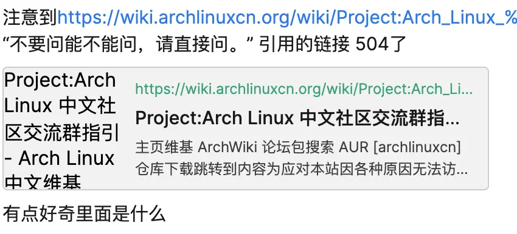
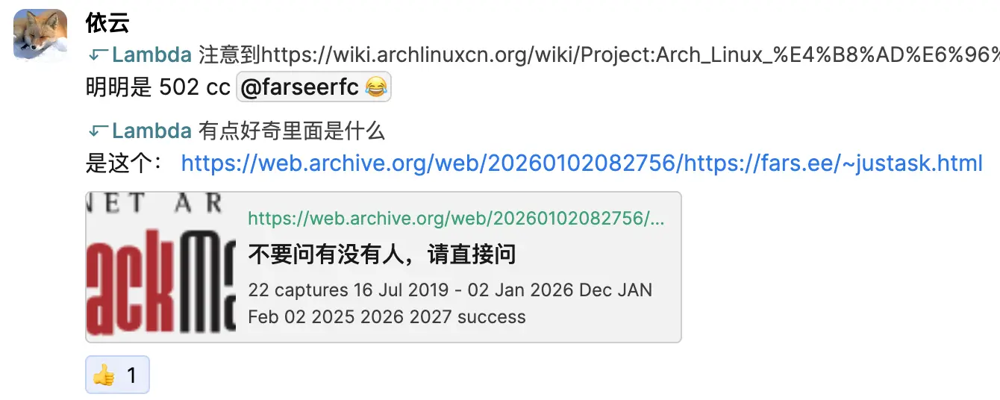
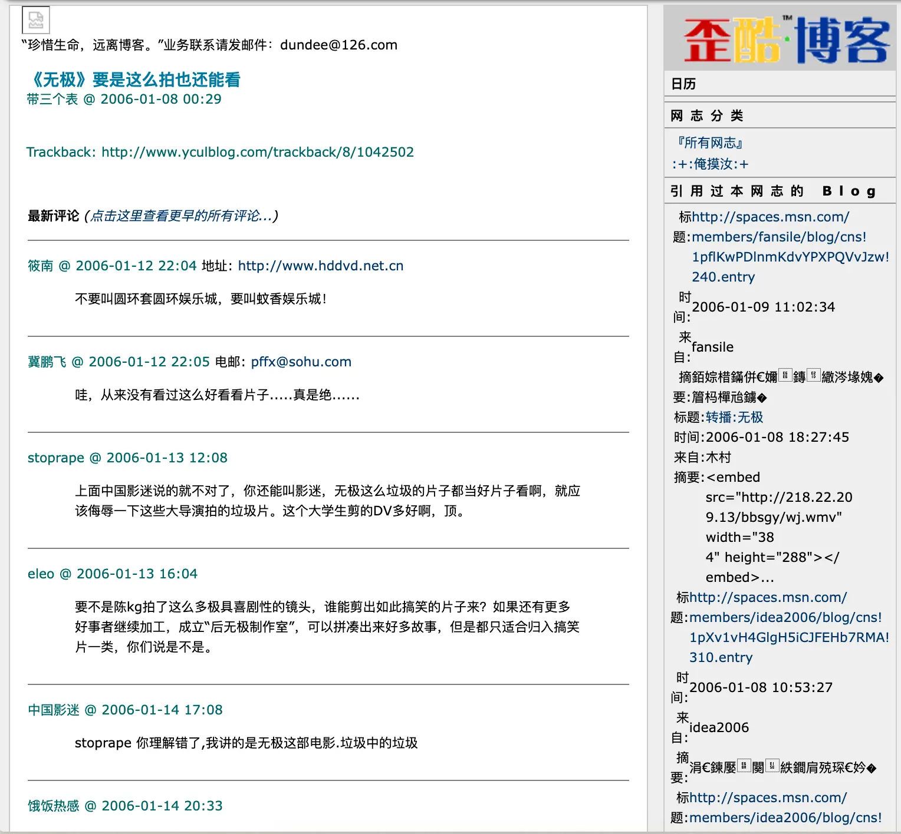
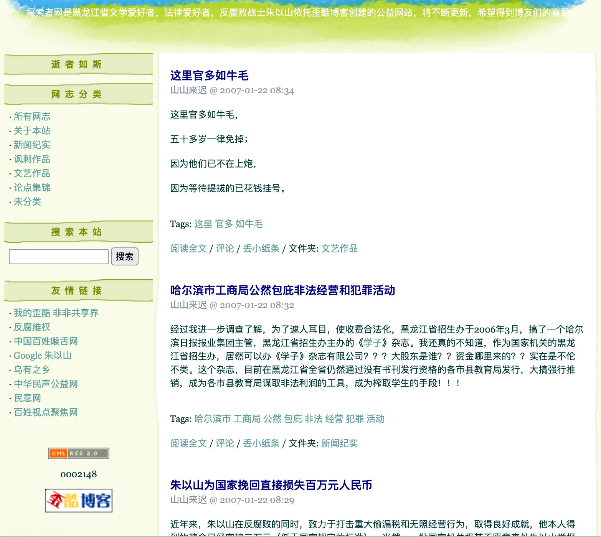
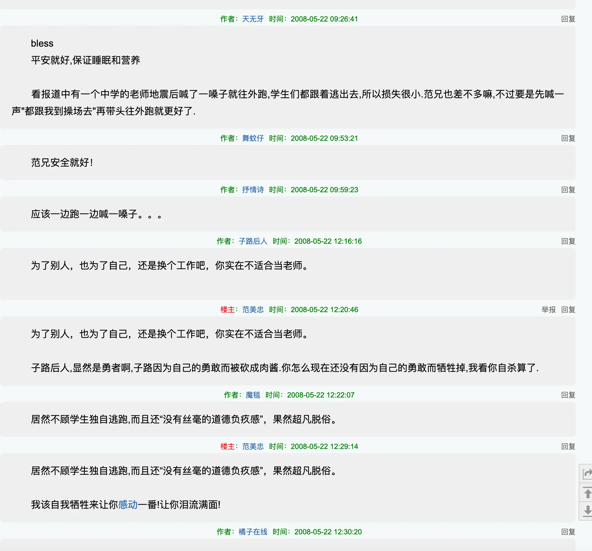

## 起因

下午逛 ArchLinuxCN 官网时，发现聊天群组规则中有一项规则名为“不要问能不能问，请直接问。”，没有过多描述，只带了个页面链接 <https://fars.ee/~justask.html/>，但我访问时得到的却是 cloudflare 504 和 502。
责任心的驱使下我在 ArchLinuxCN IRC 里反馈了这一情况，~~其实主要想知道这里究竟写了什么~~。

依旧是得到了神秘雪狐狸———依云是 ArchLinuxCN 的元老级人物，在论坛，IRC 内活跃度都非常高，给我的印象是开明，乐于助人且十年如一日24小时盯着社区———的回答。

我访问了页面，页面中描述的只是直接问 > 先问能不能问的沟通技巧。

至此我也得到了想要的答案。

本该结束了，但这成为了我第一次浏览 <https://web.archive.org/> 的契机，久闻其大名，我却从来没浏览过主页以外的其他页面。

我不禁好奇，20年前的中文互联网是什么样的。我倒还记得15年前的互联网，但也只停留在诺基亚上的文字页游———海盗船，漫威，修仙，诸如此类，
或者 uc 浏览器上的各种 h5 网游。互联网显然不会只有电子游戏，今天正好利用 webarchive 来，好好探索一下被埋没的那些记忆。

> 写到这里的时候，想回去截两张图，但是 webarchive 正好 502 了，今天我什么鬼运气啊！

## 中文互联网的影子

1999年3月1日，天涯社区由邢明创办，2006年拿到谷歌投资，盛极一时，直到2010年谷歌退出中国，一步步走向衰落，2024年彻底关停，
也算是支撑一段时期的中文互联网，与一代人的回忆吧。

我尝试在 webarchive 里翻快照，但真的就像无头苍蝇一样，webarchive不是每个页面都会抓，因此我进的好多页面都是404。

一不做二不休，直接让法学硕士帮我找！_你能帮我在waypack找找05-10年左右，早期中文互联网的一些帖子吗，好的坏的，热的冷的都可以_
据此我真的找到了一些可以浏览的页面！

### 无极这么拍倒也能看———大学生剪无极片段被人评价比原片更好看

<https://web.archive.org/web/20060203201229/http://lydon.yculblog.com/post.1042502.html/>

《无极》是一部2005年12月在大陆上映的一部电影...总之豆瓣5.5...

这篇帖子上的原视频链接已经失效了，但据评论描述，这大概是一位大学生将《无极》的片段剪辑之后的作品，甚至获得比原片更高的评价———这片到底有多烂啊。

下方的回复也十分犀利，有人不避讳的说无极就是垃圾中的垃圾，也有人直呼该作品nb。

虽然回复只有寥寥几条，但也能让人窥见一部分当时的互联网。

### 探索者———写诗抨击贪官的文学爱好者

<https://web.archive.org/web/20070123203231/http://zhuyishan.yculblog.com/>

> 探索者网是黑龙江省文学爱好者，法律爱好者，反腐败战士朱以山依托歪酷博客创建的公益网站，将不断更新，希望得到博友们的喜爱。

原网页就是上面这么写的，很简洁明了，站点如今已无法访问，不知道作者如今是否还安好。网页只被存档了第一页，
光从这一页能看到，网站的主题就是抨击贪官污吏。

虽然诗写的确实不怎么样，但能看出作者疾恶如仇的态度，作者可能遭受过当年贪官的迫害，促使他写下这些文字。顺带一提，现在的腐败问题确实比二十年前好多了。

下面是其中两篇诗的节选：

**这里官多如牛毛**

_——山山来迟_

> 这里官多如牛毛，
>
> 五十多岁一律免掉；
>
> 因为他们已不在上炮，
>
> 因为等待提拔的已花钱挂号。

**对付贪官污吏不能有丝毫客气**

_——山山来迟_

> 贪官污吏多数很有魄力，
>
> 挽救他们须早日从点滴做起。
>
> 减少蛀虫培养干才，
>
> 需要全社会的共同努力！

另外注意到他每篇文章都直接把标题拆成 tag，当然也可能是博客自动拆的。

### 那一刻地动山摇———汶川地震中的老师

<https://web.archive.org/web/20140111103710/http://bbs.tianya.cn/post-books-106727-1.shtml/>

光看标题你可能又以为是一位保护学生的老师的英雄故事，实则恰恰相反，这是一篇极其反英雄的文章，但也正因如此，它在社区内引起了相当大的讨论。

文章比较长，有兴趣的可以直接点链接看，下面只分享几段节选。

> 我曾经为自己没有出生在美国这样的自由民主尊重人权的国家而痛不欲生！因为我大学毕业十几年的痛苦与此有关，我所受的十七年糟糕教育与此有关。我无数次质问上帝：你为什么给我一颗热爱自由和真理的灵魂却让我出生在如此专制黑暗的中国？让我遭受如许的折磨！但我也曾为自己感到庆幸：我没有出生在抗日战争和解放战争时期，那样我将可能经历战争的恐怖和非正常丧失亲人的哀痛；我没有出生在共和国的前三十年，因为以我这种宁折不弯，心口如一的性格，多半会被枪毙了家人还要忍着伤痛上交子弹费；或者誓死捍卫毛主席和红色中国而其实死得一钱不值；或者经历热烈的青春之后却发现自己一无所有。

开幕就是作者———网名范美忠，对国内专制问题的剧烈抨击与怒吼，笔风极其锋利而有自己的特色。换到今天应该没人敢随便写这种文章了，除非脑袋不想要了。

但这篇文章的重点还在于下面这段：

> 我奇怪地问他们：“你们怎么不出来？”学生回答说：“我们一开始没反应过来，只看你一溜烟就跑得没影了，等反应过来我们都吓得躲到桌子下面去了！等剧烈地震平息的时候我们才出来！老师，你怎么不把我们带出来才走啊？”“我从来不是一个勇于献身的人，只关心自己的生命，你们不知道吗？

简而言之，作者上课期间遇到了当年那次汶川地震，但他轻微摇晃的时候就说了句别慌，真摇起来的时候自己马上一溜烟跑了———甚至还摔了一跤，留着一整个教室的学生不管不顾。并很诚实的表明自己是个自私的人，从我的角度来看，自私并不是什么大不了的事，但在学生面前还一副有理有据的态度，属实是有失师德了，只希望他的学生不会被他影响。

> 为了别人，也为了自己，还是换个工作吧，你实在不适合当老师。

这是一名名叫子路后人的网友给出的回复，直击本质，直接给作者干破防了，让作者给出了如下回应：

> 子路后人,显然是勇者啊,子路因为自己的勇敢而被砍成肉酱.你怎么现在还没有因为自己的勇敢而牺牲掉,我看你自杀算了.

这句歇斯底里的反驳显然激化了矛盾，后续也有陆续有更多人对作者进行抨击，但作者也不思疲倦的反击。尽管如此，当年的人都还是很文明的，和当今的互联网不一样，回帖也都是带着论点在吵架，也基本没有脏字。据悉直到2013年，即帖子发布的五年后，都还有人在帖子下留言，足以见其影响力。

不管怎样，我仍然在这篇帖子上看到了自由的互联网的影子，毕竟这种帖子在今天发出去一定会被秒封的。

## 最后

ArchLinuxCN的502和504的问题已经修好了，但探索20年前的中文互联网真是相当有趣，每个人都可以说自己想说的话，不论是好是坏，是黑是白，他们都推动中文互联网发展到了今天！感谢 webarchive 让20年后的，没有经历过这个时代的我，以及以后的所有人，都能在任何时候回顾这段时光。
