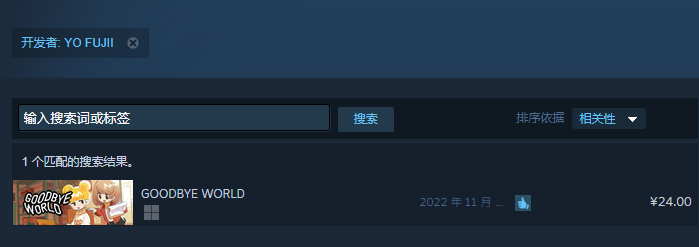
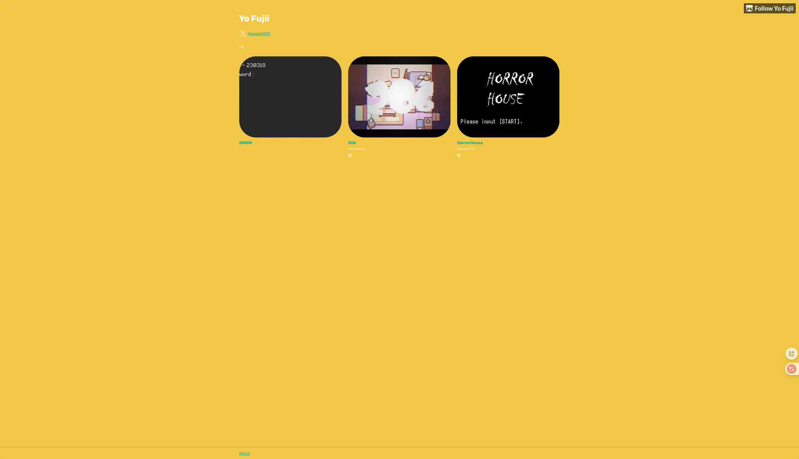
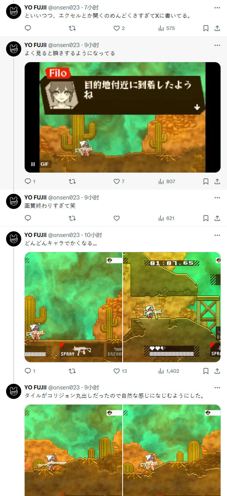
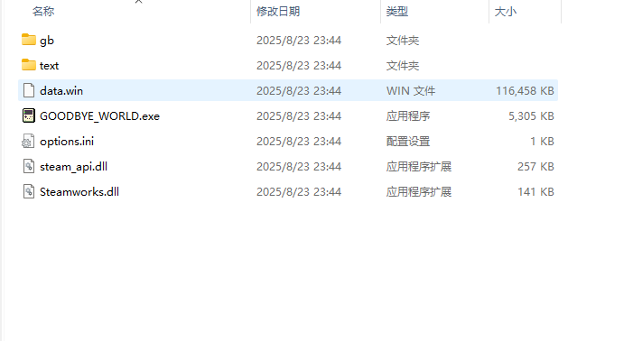
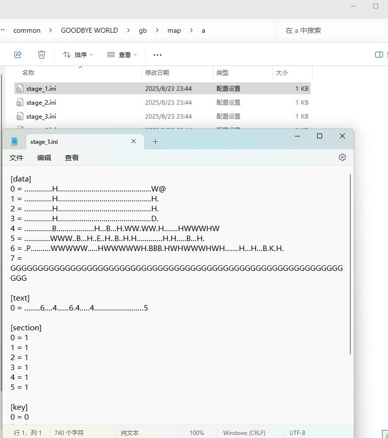
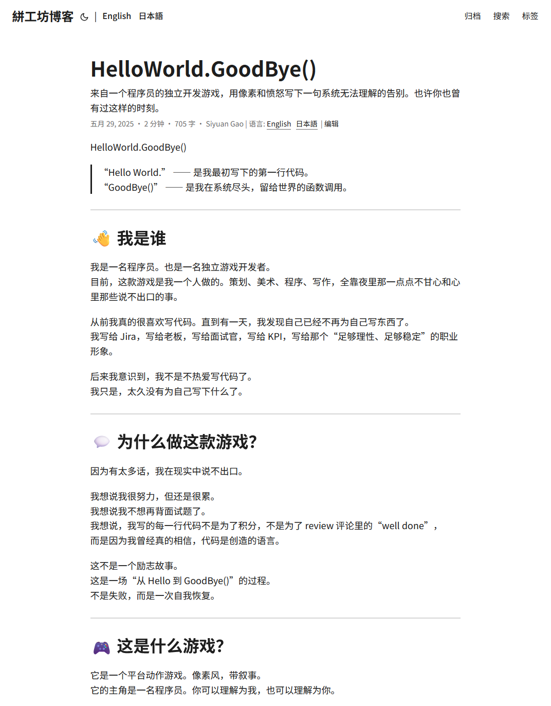
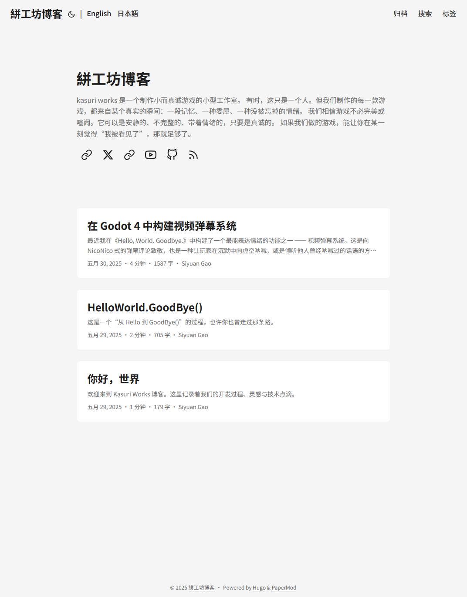
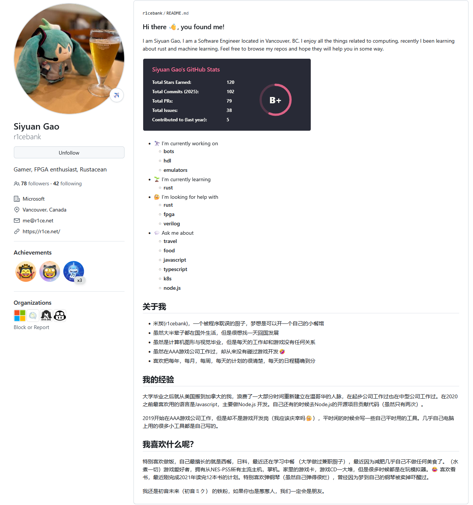
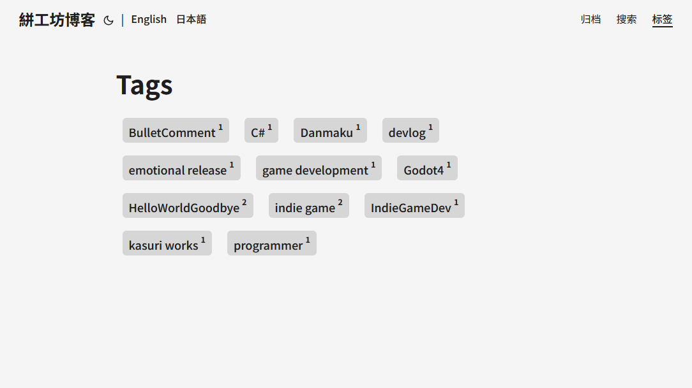

2025 年 8 月 23 日 23 点 30 分 我在 Steam 家庭库里看到一款似乎毫不起眼的小游戏《GOODBYE WORLD》。

打开评论区看了眼平均游戏时长————1-2 个小时左右，正好通关了睡觉。当时的我是这么想的来着...

游戏整体是像素风的，讲述了两个独立游戏开发者的故事。很触动人心，于是赛博视奸瘾犯了，点进了作者的作品页，发现 Steam 上仅发布了这一款游戏，反倒让我好奇起来。

出乎意料的在 google 上查到了作者的个人 blog 。比我的 blog 还简洁，但非常漂亮和有个性。

上面展示了三款游戏，点进去看了看，很容易就能看出都是复古风格的像素游戏。

随后看了看作者的 X ，头像和游戏中的她很像，相当传神了。

然后是一些其他游戏开发过程中的琐事和分享推文。

是一位充满梦想和热情，很活跃的独立游戏开发者，感觉她相当乐在其中，祝她能一直顺利。

有点好奇游戏是什么语言/引擎实现的。于是翻了翻游戏目录，根目录下有两个文件夹，一个 data.win 比较显眼。

gb 目录下是游戏内的复古滚轴小游戏的数据，用 ini 实现的关卡构造，很有趣了。

text 目录下是游戏的文本和翻译文本文件。

于是没有得到答案的我上网查了查关于 GOODBYE WORLD 的游戏引擎的事，资料相当少。

却误打误撞进了另一位游戏开发者的 blog。名为《絣工坊博客》，作者是一位不甘现状想要追逐本心的程序员。

总共只有三篇文章，而且三篇文章总共只隔了一天。到现在为止作者已经三个月没发新文章了。

这让刚玩完《GOODBYE WORLD》的我更想了解下这款游戏的开发进度了。

点进作者的 Github 主页，没想到竟然是微软的大佬，最早的提交记录位于 2010 年。超级大神啊。

然后我那个 看到高手 -> 羡慕 -> 想当高手 的反射弧又来了，就写了这篇文章，顺便抄抄《絣工坊博客》中的我鸽了小半年还没做的 blog 标签页。

顺便说一下，写完这篇文章感觉我的 blog 字好小啊，眼睛要瞎了，所以我斟酌了一下打算今天睡觉之前：

- 做好标签页
- 整体调大网站字体

还有两个感觉很有必要迫切实现的（但是今天睡前先不做了）

- 做一个点击图片放大的遮罩
- 夜间模式（这个不知道要弄多久。。）
