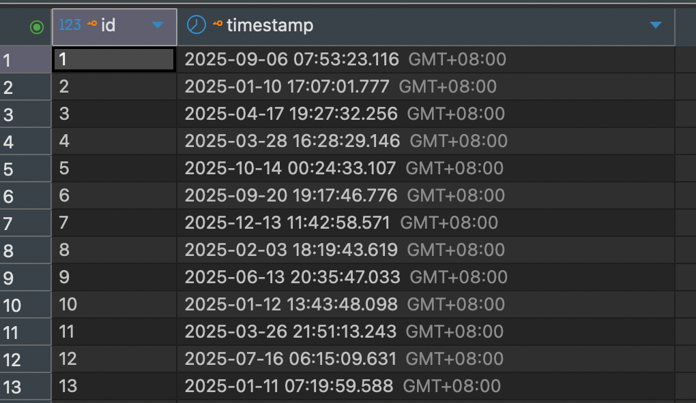

昨天在群里看到群友在讨论对于只存日志的表，主键的必要性，以及索引在滥用情况下的空间占用可能比数据还要大等等问题。大佬们对数据库的理解之透彻，甚至于讨论到了“如果我是秦始皇，那数据瞎几把存不建任何索引的查询性能是最高的”。

但其中有群友指出 {timestamp(带索引)} 的表会比 {id, timestamp}(复合主键) 占用空间更小，因为前者会创建两个b+树，后者只会创建一个，这个话题让我很感兴趣。一个一列表，一个两列表，两列的比一列的小，为什么会有这样反直觉的情况？

与其上网搜，不如自己先实验一下，我用三种主流的数据库，MySQL（同时测试myisam和innodb引擎）, PostGreSQL, SQLite，按上述的方式进行测试，再看占用空间。

下方是我使用的建表语句

MySQL(myisam引擎)

```sql
DROP TABLE IF EXISTS t2_ts_myisam;
DROP TABLE IF EXISTS t1_pk_myisam;

CREATE TABLE t1_pk_myisam (
  id           BIGINT       NOT NULL,
  `timestamp`  DATETIME(6)  NOT NULL,
  PRIMARY KEY (id, `timestamp`)
) ENGINE=MyISAM DEFAULT CHARSET=utf8mb4;

CREATE TABLE t2_ts_myisam (
  `timestamp`  DATETIME(6)  NOT NULL,
  KEY idx_t2_ts (`timestamp`)
) ENGINE=MyISAM DEFAULT CHARSET=utf8mb4;
```

MySQL(innodb引擎)

```sql
DROP TABLE IF EXISTS t2_ts_innodb;
DROP TABLE IF EXISTS t1_pk_innodb;

CREATE TABLE t1_pk_innodb (
  id           BIGINT       NOT NULL,
  `timestamp`  DATETIME(6)  NOT NULL,
  PRIMARY KEY (id, `timestamp`)
) ENGINE=InnoDB DEFAULT CHARSET=utf8mb4;

CREATE TABLE t2_ts_innodb (
  `timestamp`  DATETIME(6)  NOT NULL,
  KEY idx_t2_ts (`timestamp`)
) ENGINE=InnoDB DEFAULT CHARSET=utf8mb4;
```

PostGreSQL

```sql
DROP TABLE IF EXISTS t2_ts;
DROP TABLE IF EXISTS t1_pk;

CREATE TABLE t1_pk (
  id          BIGINT     NOT NULL,
  "timestamp" TIMESTAMP  NOT NULL,
  PRIMARY KEY (id, "timestamp")
);

CREATE TABLE t2_ts (
  "timestamp" TIMESTAMP  NOT NULL
);
CREATE INDEX idx_t2_ts ON t2_ts ("timestamp");
```

SQLite

```sql
DROP TABLE IF EXISTS t2_ts;
DROP TABLE IF EXISTS t1_pk;

CREATE TABLE t1_pk (
  id          INTEGER   NOT NULL,
  "timestamp" DATETIME  NOT NULL,
  PRIMARY KEY (id, "timestamp")
);

CREATE TABLE t2_ts (
  "timestamp" DATETIME  NOT NULL
);
CREATE INDEX idx_t2_ts ON t2_ts ("timestamp");
```


建表后，无数据，各表大小：

| 数据库       | 表名           | 数据大小   | 索引大小    | 总大小      | 总大小(字节) |
| ------------ | -------------- | ---------- | ----------- | ----------- | ------------ |
| MySQL MyISAM | t1_pk_myisam   | 0 bytes    | 1024 bytes  | 1024 bytes  | 1024         |
| MySQL MyISAM | t2_ts_myisam   | 0 bytes    | 1024 bytes  | 1024 bytes  | 1024         |
| MySQL InnoDB | t1_pk_innodb   | 16 kB      | 0 bytes     | 16 kB       | 16384        |
| MySQL InnoDB | t2_ts_innodb   | 16 kB      | 16 kB       | 32 kB       | 32768        |
| PostgreSQL   | t1_pk          | 0 bytes    | 8192 bytes  | 8192 bytes  | 8192         |
| PostgreSQL   | t2_ts          | 0 bytes    | 8192 bytes  | 8192 bytes  | 8192         |
| SQLite       | t1_pk          | 4096 bytes | 4096 bytes  | 8192 bytes  | 8192         |
| SQLite       | t2_ts          | 4096 bytes | 4096 bytes  | 8192 bytes  | 8192         |


使用python脚本，为三张表插入完全相同的随机数据，每张表 5 万条，效果如下图



再查询各表大小：

| 数据库       | 表名             | 数据大小 | 索引大小 | 总大小 | 总大小(字节) |
| ------------ | ---------------- | -------- | -------- | ------ | ------------ |
| MySQL InnoDB | t1_pk_innodb     | 2576 kB  | 0 bytes  | 2576 kB | 2637824      |
| MySQL InnoDB | t2_ts_innodb     | 2576 kB  | 1552 kB  | 4128 kB | 4227072      |
| MySQL MyISAM | t1_pk_myisam     | 830 kB   | 1132 kB  | 1962 kB | 2009168      |
| MySQL MyISAM | t2_ts_myisam     | 439 kB   | 826 kB   | 1265 kB | 1295824      |
| PostgreSQL   | t1_pk            | 2168 kB  | 1552 kB  | 3752 kB | 3842048      |
| PostgreSQL   | t2_ts            | 1776 kB  | 1296 kB  | 3104 kB | 3178496      |
| SQLite       | t1_pk            | 1824 kB  | 2116 kB  | 3940 kB | 4034560      |
| SQLite       | t2_ts            | 1660 kB  | 1892 kB  | 3552 kB | 3637248      |

可以看到 myisam, pg, sqlite 都呈现出 id + ts 组合主键占用的空间大于 ts 加索引，只有 innodb 相反

再加一百万行数据试试


| 数据库       | 表名           | 数据大小 | 索引大小 | 总大小 | 总大小(字节) |
| ------------ | -------------- | -------- | -------- | ------ | ------------ |
| MySQL InnoDB | t1_pk_innodb   | 36 MB    | 0 bytes  | 36 MB  | 37322752     |
| MySQL InnoDB | t2_ts_innodb   | 33 MB    | 36 MB    | 68 MB  | 71450624     |
| MySQL MyISAM | t1_pk_myisam   | 16 MB    | 22 MB    | 38 MB  | 40152640     |
| MySQL MyISAM | t2_ts_myisam   | 8789 kB  | 16 MB    | 25 MB  | 25984064     |
| PostgreSQL   | t1_pk          | 42 MB    | 30 MB    | 72 MB  | 75849728     |
| PostgreSQL   | t2_ts          | 35 MB    | 30 MB    | 64 MB  | 67231744     |
| SQLite       | t1_pk          | 37 MB    | 43 MB    | 79 MB  | 83304448     |
| SQLite       | t2_ts          | 33 MB    | 37 MB    | 70 MB  | 73342976     |

差异更明显了，为什么会这样？

（我暂时也不知道，后续补全）