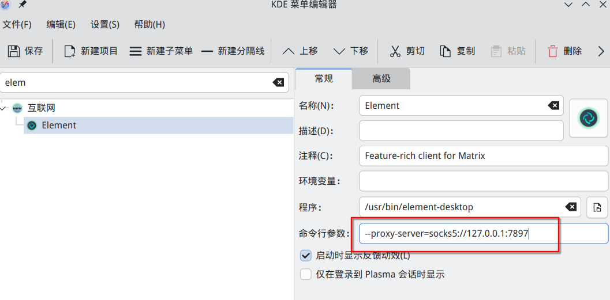

## 1. 杂项

### 1. git 每次 push 都要输入用户名 token

`git config --global credential.helper store` 将登陆过的用户名和 token 永久保存在`~/.git-credentials`中。

### 2. `git status`中文显示乱码

`Git`有一个设置叫做`core.quotepath`，它控制 git 是否将文件路径中的非 ASCII 字符（如中文）
转义为类似 `\356\205` 这样的形式。默认情况下，`Git` 会将非 ASCII 字符转义以确保兼容性。

使用`git config --global core.quotepath false`关闭转义。

### 3. element-desktop 应用使用代理

该方法适用于任何 electron 应用

添加启动参数`--proxy-server=host:port`

例如:`--proxy-server=socks5://127.0.0.1:7897`

如果使用 plasma 桌面环境，可在菜单编辑器中如下图配置，并点击左上角保存



### 4. 对已存在的 docker 容器设置自启动

```shell
docker update --restart=always CONTAINER_NAME
```

### 5.git`warning: in the working copy of ..'`

Git 配置了自动转换换行符（LF -> CRLF）会在 提交时将 LF 自动转换为 CRLF（Windows 换行符）

```shell
#关闭换行符转换：
git config --global core.autocrlf false

# 使用LF作为标准换行符：
git config --global core.eol lf
git config --global core.autocrlf input
```

## 2. archlinux 相关

### 1. nvidia，nvidia-open 驱动都无法调用显卡

如果你不是`linux`内核或者`linux-lts`内核，你需要安装`linux-dkms`

### 2. 检测不到音频设备，音频无声

检查是否安装了`linux-headers`，`alsa-firmware`，一些较新型号
的笔记本电脑（2019 年底/2021）需要`sof-firmware` 和
`alsa-ucm-conf`，它们使用 Sound Open Firmware
提供的固件实现驱动程序。安装完成后重启电脑。
[来源](https://wiki.archlinuxcn.org/wiki/ALSA#%E6%8E%92%E9%99%A4ALSA%E6%95%85%E9%9A%9C)

### 3. qq 中无法使用 fcitx 输入法

~~编辑 /usr/bin/linuxqq 在该启动脚本第一行加上 `export GTK_IM_MODULE=fcitx`~~

上述方法会在每次更新 qq 后概率失效，不推荐

KDE 环境建议在菜单管理器添加`GTK_IM_MODULE=fcitx`，总之让 QQ 启动时能有该环境变量，但该环境变量不推荐设置全局

### 4. “电源管理方案”无法调整，调整会回弹回平衡

安装 `powerdevil`包和`power-profiles-daemon`包，
启动`power-profiles-daemon`的 systemd 服务
（`systemctl enable power-profiles-daemon`）然后重启  
[archlinux-电源管理](https://wiki.archlinuxcn.org/wiki/%E7%94%B5%E6%BA%90%E7%AE%A1%E7%90%86)

### 5. 使用 wqy-microhei 时，韩文字体堆叠在一块，不正常显示

该字体有缺陷，安装`wqy-microhei-kr-patched`(aur)字体包可修复

## 3. neovim/lazyvim 相关

### 1. lazyvim 不要求，但不安装会缺胳膊少腿的软件包

|                   |                                              |
| ----------------- | -------------------------------------------- |
| `lazygit`         | 提供 lazyvim 内图形化 git 支持，本身也很好用 |
| `luarocks`        | 必须依赖                                     |
| `xclip` 或 `xsel` | 剪贴板支持                                   |
| `nodejs` `npm`    | 安装某些 Mason 需要                          |
| `unzip`           | 安装某些 Mason 需要                          |
| `ripgrep`         | 高速搜索工具                                 |
| `fd`              | 搜索工具                                     |
| `tree-sitter`     | 语法解析高亮工具                             |
| `fzf`             | 模糊搜索工具                                 |

### 2. neovim 在 kde 环境下无法访问剪贴板

安装 xclip 即可，然后在 neovim 中用指令（如 yy,dd）复制剪切都会进 kde 的剪贴板

### 3. 安装 Mason 后仍不能格式化或补全，右上角出现红色提示

输入`:LazyExtras`移动到推荐的插件上按`x`，退出重进会自动安装插件

### 4. quickfix 一直为空

这是正常情况，一般 lsp 都使用`<leader>ca`修复
