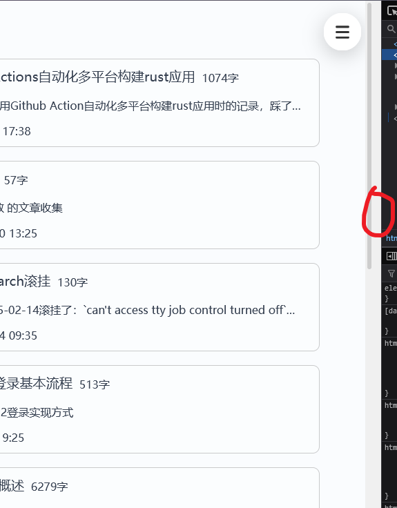

## 问题

我用 css + js 实现了一个汉堡菜单的组件，其中当汉堡菜单弹出并关闭后，滚动条右侧会出现异常的白色占位条。这个占位条无法被 f12 选中。

正常的滚动条:

出现在滚动条右侧的异常的白色占位条:


我认得这个占位条，它是在页面没有滚动条时占位，以保证页面切换时宽度一致的。想要启用它只需设置：

```css
html {
  overflow-y: scroll; /*总是显示滚动条*/
}
```

按理来说，我的页面中已经存在了滚动条，这个占位条是不该存在的。

## 解决方案

发现问题存在于：

```js
// 打开菜单
function toggleMenu() {
  ...
  body.style.overflow = sidebar.classList.contains("active")
    ? "hidden"
    : "auto";
}

// 关闭菜单
function closeMenu() {
  ...
  body.style.overflow = "auto";
}
```

此处，我使用了`body.style.overflow`来直接设置滚动条样式，在关闭菜单时，突如其来的`body.style.overflow = "auto";`使得浏览器出现渲染不同步。
使用 js 直接修改样式是很坏的，浏览器很多时候无法响应。更好的做法是使用类名携带样式，再使用 js 进行类名的切换：

```js
// 打开菜单
function toggleMenu() {
  ...
  body.classList.toggle("no-scroll", sidebar.classList.contains("active"));
}
// 关闭菜单
function closeMenu() {
  ...
  body.classList.remove("no-scroll");
}
```

```css
/* 此处的 is:inline 是在astro组件中使用的，用于将css直接传递给浏览器，不使用astro的话不需要 */
<style is:inline>
  .no-scroll {
    overflow-y: hidden;
  }
</style>
```

然后白色占位条就顺利消失了
