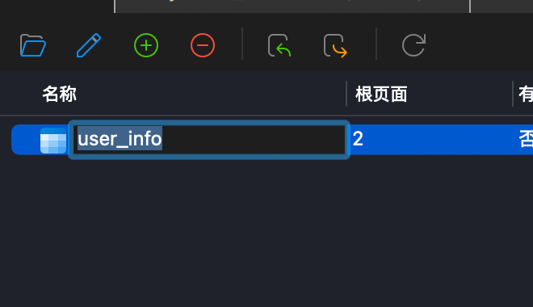
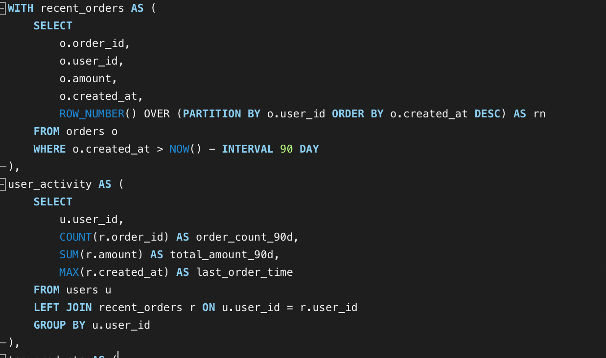
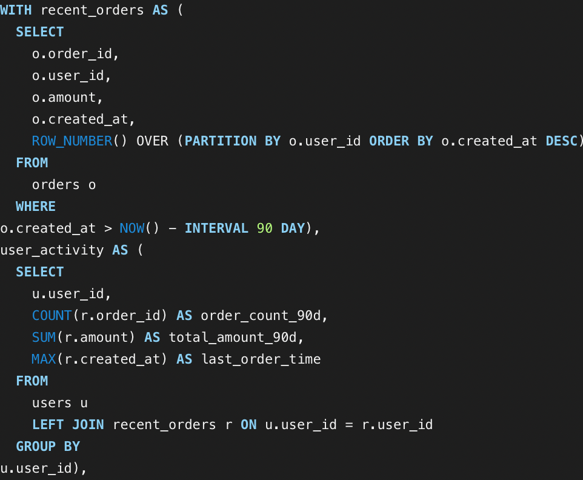
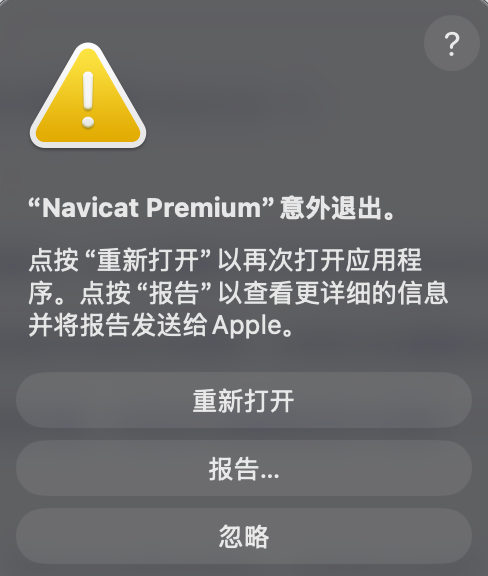
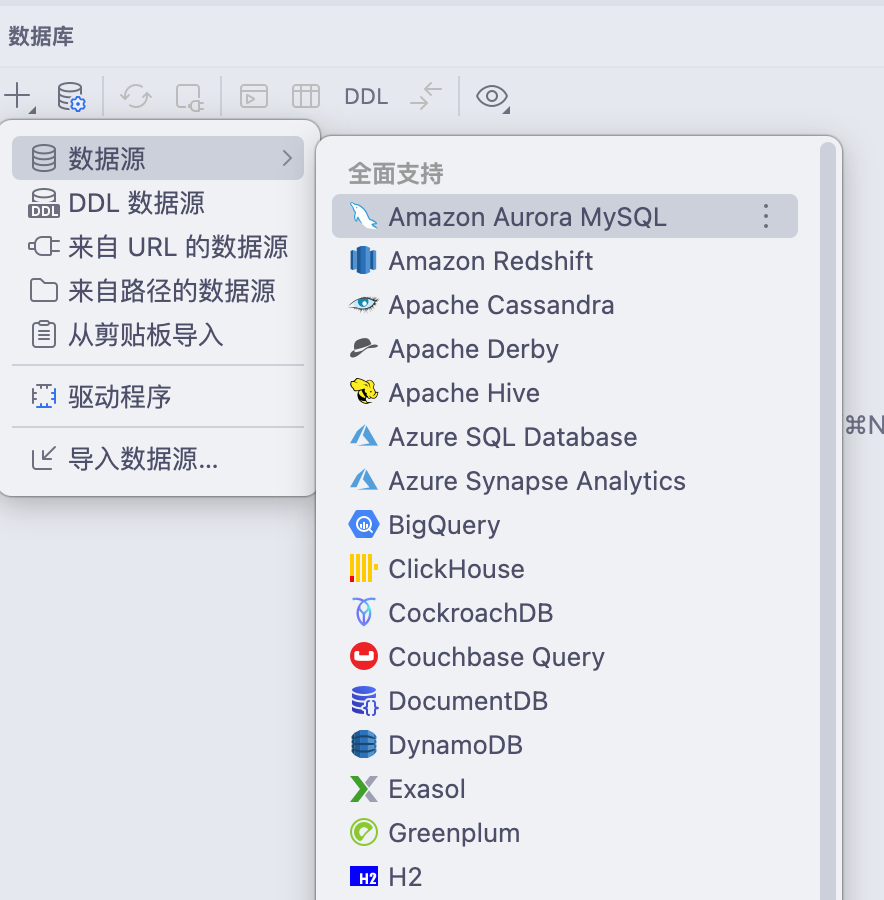
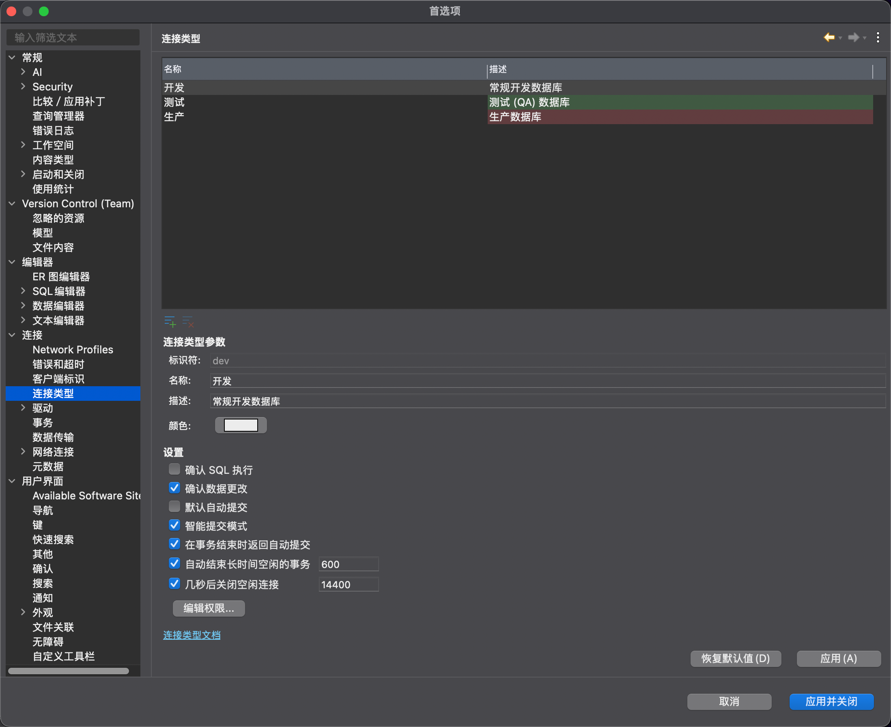
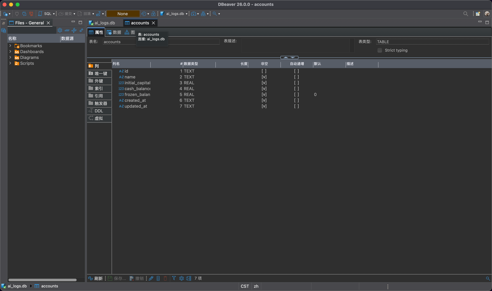
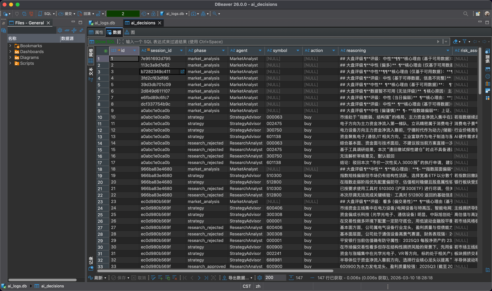
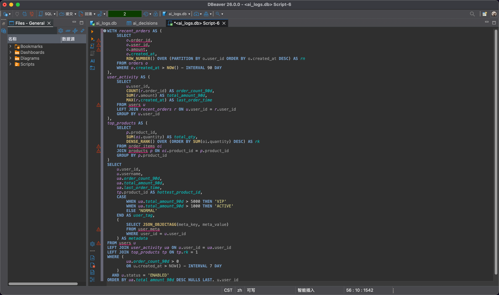

## 再见 Navicat

事先声明，我不是专业的 DBA，但使用 Navicat 也快两年了，这片文章可能有浓重的个人情绪和踩一捧一环节，请注意。

### 有名的 Navicat

入门 SQL 时，很多人都会用到 SQL Server Enterprise Manager， Navicat等数据库连接工具。

其中Navicat作为一款数据库连接工具，其最早的 Windows 版本发布于 2002 年 3 月，在一众数据库连接工具中算是十足的老资历了，Navicat 以其低占用，入门简单，支持数据库种类繁多而广为人知，甚至成了很多课程的教学指定数据库连接工具。

但我决定放弃 Navicat。

### 危险的 Navicat

Navicat 很多设计不是围绕操作安全，而是围绕操作简单方便以及界面简洁低占用来设计的。

针对需要直接操作生产环境库的情况下，使用 Navicat 是相当危险的。

#### 默认不开启事物，修改立即生效

Navicat 默认不开启事务，修改数据时，鼠标一旦点击编辑区之外的单元格，修改就会立即生效。修改某格数据时，不小心点到其他地方误改了数据，虽然无伤大雅，重新修改即可，但假如一时疏忽，脏数据就会永远封存到数据库里，直到某天某个诡异的 bug 让他重见天日。

对于这一点 Navicat 的确有缓解方案———打开设置中的自动开启事务，这样你点击编辑区之外的单元格时，必须点击提交事务，修改才会生效。

这一方法确实能够缓解误操作修改数据的问题，但频繁自动开启事务后进行写操作，可能会导致行锁，卡住其他对于这行数据执行的 SQL。

#### 重命名表无需任何确认

点击两次表名，自动进入重命名状态。

重命名后无需任何确认，同样是点击其他地方自动提交，有可能你一个不注意，选表的时候就把某个表名改了，然后你的服务就开始发癫`MySQLSyntaxErrorException: Table 'user_info' doesn't exist`...

#### 糟糕的补全

用 Navicat 写 SQL 有种在 VsCode 不装任何拓展情况下敲代码的感觉，补全乱七八糟，因为他不会在你敲 SQL 的时候读你的表结构。另外，它自带的格式化真的很烂。

#### 崩溃问题

我用的是 MacOS 系统，经常遇到 Navicat UI 莫名卡死或直接崩溃的问题，我承认我是在交换内存经常10G的情况下使用 Navicat 的，但这玩意崩溃频率也太高了，其他软件可能两周有一两次崩溃，这玩意挂在后台天天崩。

#### Navicat 的总结

综上，Navicat 的安全性低，功能弱，自定义程度低，价格较贵，虽然 Navicat 也有其优势：

- 占用比较低
- 操作简单，好上手
- UI漂亮

但瑜不掩瑕，他在我这基本上没有复活的风险了。

## 还有什么能用

### DataGrip

JB 出品，必为精品，JB家的插件生态只能用`！？强强？！`来形容，DataGrip 作为 JetBrains 家的重量级数据库连接工具，安全，功能强大，插件丰富，UI 自定义程度强。

但他和 JB 家的其他软件一样，都属于**内存杀手**。作为 Java 开发的数据库连接工具，DataGrip 的内存占用与其他数据库连接工具横向对比时显得相当大，日常使用过程中都有 2 - 4 GB 的占用。

只开着这一款软件可能还好，但数据库工具经常需要和 IDE，编辑器一起开着，如果你的电脑内存小于等于 16GB 还想要流畅的体验，请慎重选择。

### IntelliJ IDEA

~~内置的数据库连接好像也不是不能用。~~

### DBeaver

**免费开源，震撼美味**

我确实喜欢上了这款数据库连接工具，编写 SQL 的舒适度，安全性，可自定义程度都做的非常好。

可以手动将库设为只读。

丰富强大的设置。

支持超多数据库种类。（达梦这种国产数据库都支持我是真没想到）

可以说 Navicat 有的，他都有，你甚至可以让他执行任何 SQL 前都让你手动允许。

演示图：

缺点：

- 外观有点丑。
- Java 写的，占用比 Navicat 略高，但比 DataGrip 低，常态占用大概 1 - 2GB。
- 非 pro 版本不支持部分非关系型数据库（如 Mongo Redis）。

### 其他连接工具

连接工具的种类繁多，并不止上面这些。上面这些只是我比较熟悉，且我认为比较值得介绍的。

## 最后

工具的选择需要权衡利弊，没有最好的，只有最适合的，希望这篇文章能够帮到你选择适合自己的数据库连接工具。
