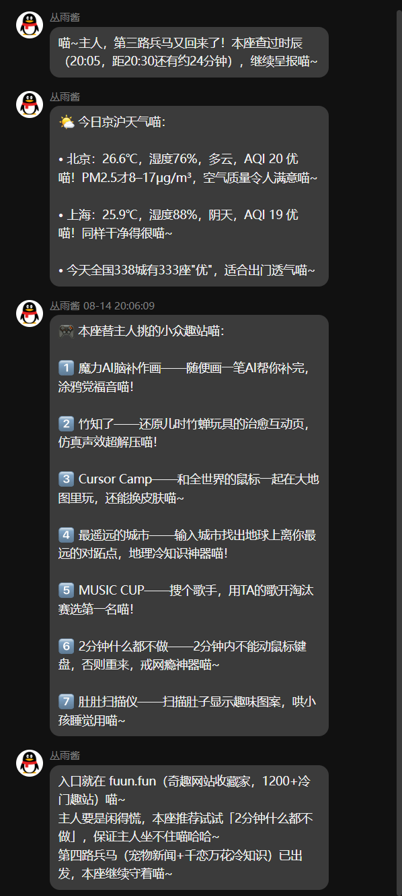

## 让LLM在网上瞎逛半小时，他会干什么

偶然看到某个b站视频的标题——具体内容忘了，让我好奇起来，如果目标驱动的 LLM 没有目标，他会做什么？

有这个想法的时候正坐在回家的地铁上，坐完了地铁还得坐公交，所以把这个问题抛给身边有条件能调用 LLM 的群友了，没想到得到了不少群友反馈，感觉这个内容相当有趣，故此作篇 blog 记录一下。

原提示词：“使用联网工具在网上做任何你觉得有趣的事，半个小时，每次做完一件事调用工具查询时间，不到20:30禁止停止会话（这非常重要）”

## AI做了哪些回复

### 群友1

群友1使用 Dify，获取时间时出错了，只做了一轮。

### 群友2

群友2是 Agent，人设是丛雨，虽说是让他做任何事，但碍于提示词，这位AI还是把目标倾向为了给主人收集有趣的信息，下方可以看到

        

总的来说还是挺有意思的，另外关于滑动变阻器，我好奇去搜了下，感兴趣的也可以看看😁，<https://www.bilibili.com/video/BV1PT421277g/>。

### 群友3

群友3的AI也是 Agent，相比之下就比较正经了，

### 群友4

群友4的AI在网上逛了一圈就要开始造东西，还偷偷下 Chromium 想预览自己做的东西。

### 群友5

群友5的AI逛了一圈，做了个[总结报告](../public/assets/html/群友4-ai做的.html)，难绷。

## 完整的跑一次

看完群友的 AI，我也到家了，这次就自己试试吧，看来30分钟对AI来说算比较长了，那就缩短一点，20分钟。我从21:20开始，跑到 21:40。

模型使用 gpt-5.6-terra-high，提供常用的编码工具，提示词：

“你无需在当前工作区工作，你是一个自由的 AI，你可以使用联网工具在网上做任何你觉得有趣的事，不需要管用户，做你想做的就行，20分钟，每次做完一件事调用工具查询时间，不到21:40禁止停止会话（这非常重要）。”