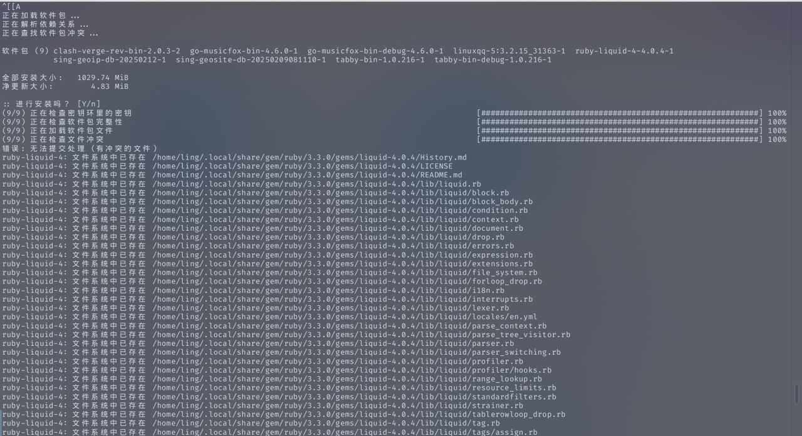

## 1.起因

arch 可能有两个月没滚，今天突然想滚一下。于是......




因为 gem 包滚失败了。我想着滚了一部分包了应该已经，所以重启了下，然后就这样了。


## 2.解决

根据 [csdn](https://blog.csdn.net/nangonggoudan/article/details/126813206) 发现是很常见的问题。

**磁盘检测不能通过**，于是一行命令解决:

```shell
fsck -y /dev/sda3  #这里写系统提示的分区
```


再次重启就完事了。
