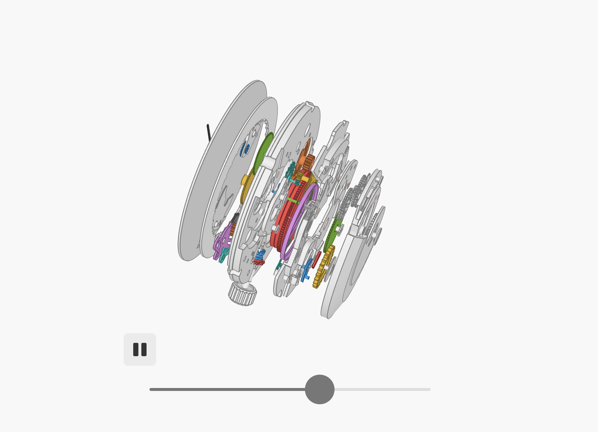

## 1. 杂项

### 1. 华人魔道四大天王程序员

[华人魔道四大天王程序员](https://yygcode.com/blogs/2020/01/famous-4-coder.html)

- [胡正](http://www.huzheng.org/)
- [李杀](http://xahlee.org/)
- [王垠](http://www.yinwang.org/)
- [田春](http://tianchunbinghe.blog.163.com/)

在电报看到了 `胡正：一位精神分裂IT天才失去的15年 https://mp.weixin.qq.com/s/B5n17jToJoPBVZkuuixlfw`

有感去搜索了这位大神的相关信息，找到了介绍上述四位大神的文章，他们的博客站点都很有趣。

### 2. 机械表

hacker news [经典帖子](https://news.ycombinator.com/item?id=48553550)，一个由 webgl 编写的精密机械表，并不是简单的摆件。

<https://ciechanow.ski/mechanical-watch/>

