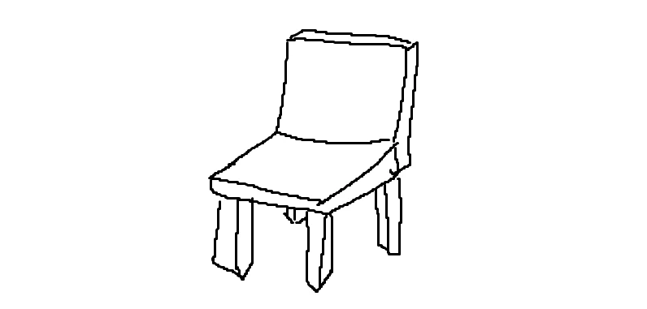

## LingLambda 的温馨小站

站点于 24 年初创立，起初使用 WordPress，很漂亮，但服务器带宽小带不动，迁移麻烦(有一次迁移的时候铸币了丢了两篇文章，后来重新写了)。

于是 24 年末改用 jekyll，用 markdown 随时随地有 git 就能写博客了，很方便。

后来想做自定义，但 Rudy 苦手，于是凭着自己超烂的前端水平构建起了如今的小站，**目前还在努力建设中**，现在在做：**移动端适配**，总之欢迎你！

累了吗，可以在下面的椅子上休息，坐多久都可以！

